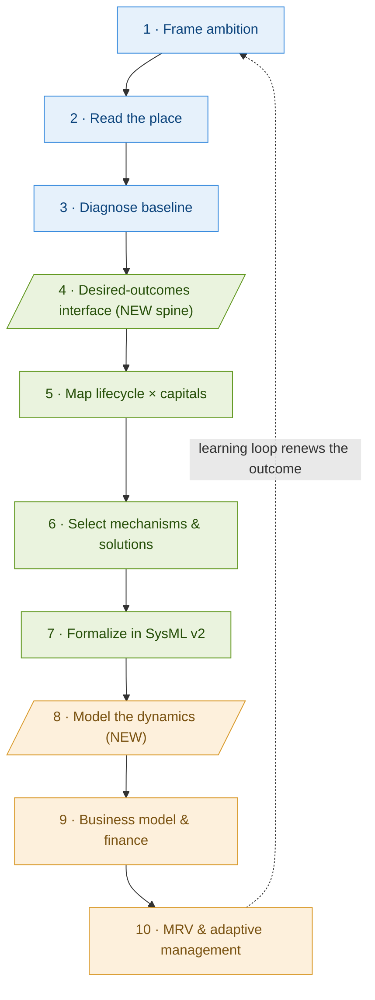
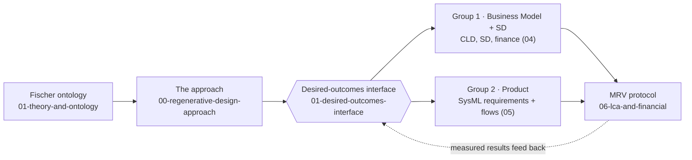

# Regenerative Systems Design Approach

**Version:** 0.1 (2026-07-02)
**Owner:** INCOSE / GfSE Sustainability WG — Regeneration Task-Force
**Status:** Draft for first Task-Force meeting

This is the Task-Force's single methodical approach. It is written **generic first** (any engineered system) and then **instantiated for PV** (SolarX → SustainaSun). It supersedes the PV-only framework in `pv-case-study/`, which is retained as the worked PV example.

---

## 1. The organizing idea

The whole approach turns on one unit: a **desired outcome that regenerates**.

Fischer et al. (2024) define regenerative dynamics as an *upward helix* — a desired outcome that improves repeatedly, is partly self-perpetuating (endogenous momentum), but still needs ongoing energy, labour and materials to keep going, and stops rising at natural limits. This gives the Task-Force three design consequences that the rest of the method is built around:

1. **You design for outcomes, not features.** A regenerative system is defined by which desired outcomes it makes go up over time (soil carbon, biodiversity, community wealth, material circularity), not by which green components it contains.
2. **Regeneration is a behaviour over time, so it must be modelled dynamically.** A static business case cannot show an upward helix. Feedback loops (System Dynamics) can.
3. **Restoration is not regeneration.** Fixing damage once (exogenous) is a *prerequisite*; regeneration means the system then sustains and renews the outcome through normal operation (endogenous).

From this, one artefact ties everything together: the **desired-outcomes interface** (`01-desired-outcomes-interface.md`). Each desired outcome appears there once and is used four ways — as a **CLD stock** (dynamics), a **financial line-item** (feasibility), a **SysML requirement** (product), and an **MRV target** (measurement). That single list is what keeps the two working groups from producing artefacts that don't interlock.

---

## 2. The three goals map onto three parts

The Task-Force's goal has three parts. The method is organised so each part owns a block of steps.

| Goal | Part | Steps | Owner |
|---|---|---|---|
| Integrate regenerative dynamics into the system | **B · Design** | 4–7 | Group 2 (with Group 1 on step 4) |
| Have measures to assess regeneration | **C · Prove** | 10 (MRV) | Both groups |
| Make it economically feasible | **C · Prove** | 8–9 | Group 1 |
| (Set the direction first) | **A · Frame** | 1–3 | Both groups |

---

## 3. The generic process (any engineered system)

### At a glance

*Blue = **A · Frame** (set the direction) · Green = **B · Design** (integrate regeneration) · Amber = **C · Prove** (feasibility + measurement). Steps 4 and 8 (parallelograms) are the connective tissue the gaps review found missing; the dotted learning loop is what makes the system regenerative rather than one-off.*

### Part A — Frame: what should regenerate?

**Step 1 — Frame regenerative ambition.**
State the ambition as Triple Top Line (Economy + Ecology + Equity, all positive, no trade-offs) across the five/six capitals (natural, human, social, manufactured, financial). Decide, in Fischer's terms, which desired outcomes this system exists to raise.
*Output:* one-page ambition statement.

**Step 2 — Read the place.**
Regeneration is place-specific. Use Regenesis Story of Place; map the bioregion, its ecological limits, and the communities affected. Where Traditional Ecological Knowledge is relevant, engage it as first-class engineering knowledge under FPIC and CARE principles, not as an appendix.
*Output:* place dossier.

**Step 3 — Diagnose the baseline state.**
Establish where the system sits today: a Doughnut Economics read (which social floors and ecological ceilings are breached), a baseline LCA of the conventional system (ISO 14040/44), and a plain description of the **degenerative dynamics** currently running (the downward helices you intend to reverse).
*Output:* baseline LCA + degenerative-dynamics map.

### Part B — Design: how does the system regenerate?

**Step 4 — Define desired outcomes and targets → the interface.**
This is the pivot step and the shared contract between the groups. Pick the 8–10 desired outcomes from Step 1, and for each set a measurable target, a baseline, and a direction of travel. Record them in `01-desired-outcomes-interface.md`. Every later step reads from this list.
*Output:* the desired-outcomes interface (populated).

**Step 5 — Map lifecycle × capitals.**
Lay the system's lifecycle stages against the capitals in a matrix. In each cell, name the degenerative vector (how value leaks today) and the regenerative vector (how the design reverses it). This locates *where* in the lifecycle each desired outcome is won or lost.
*Output:* populated lifecycle-capital matrix (see `diagrams/lifecycle-capital-matrix.drawio`).

**Step 6 — Select mechanisms and solutions.**
Turn regenerative vectors into concrete interventions using the five recurring mechanisms (`diagrams/five-mechanisms.drawio`) and the 144-solution catalogue (`../00-foundations/`). Flag overclaiming honestly — apply the ReFi / holistic-grazing / Bastin / Rodale critiques wherever a solution is asserted beyond its evidence.
*Output:* solution-instantiated matrix.

**Step 7 — Formalize in MBSE / SysML v2.**
Only now does the model appear. Write each desired outcome as a `requirement def`; add the system functions that produce it and the ecological ports/flows (water, biomass, material recovery, social value) that the conventional model lacks. Trace every regenerative requirement back to the interface. MBSE is the final formalization layer, never the front-end framing.
*Output:* extended SysML v2 model (Group 2).

### Part C — Prove: is it feasible and real?

**Step 8 — Model the dynamics.**
Build the causal loop diagram, then parameterize it into a System Dynamics model (stocks = the desired outcomes from Step 4). Show whether the reinforcing loops (e.g. soil health → yield → reinvestment; trust → permitting → scale) actually compound over the system's life, and where balancing loops (compliance overhead, market saturation, natural limits) cap them.
*Output:* CLD + runnable SD model.

**Step 9 — Business model and financial feasibility.**
Design the business model around the desired outcomes: which are bankable today, which are optionality, which are cost. Build the financial model (capital structure, revenue mechanisms, scenarios). Then test the core thesis honestly — not "IRR parity" but **risk-adjusted performance against a defined conventional baseline**, with sensitivity analysis showing under what conditions regeneration outperforms, matches, or underperforms extraction.
*Output:* business model + financial model + sensitivity analysis.

**Step 10 — MRV and adaptive management.**
Make the regeneration claim falsifiable. For each desired outcome, define the measurement method, cadence, verification standard, data owner, and attribution logic (`mrv-protocol.md` lives in `../06-lca-and-financial/`). Measure, verify against an external standard (TNFD / SBTN / EOV / ICVCM as applicable), report, and feed the results back to Step 1.
*Output:* MRV protocol + first measurement cycle → loop back to Step 1.

The loop from Step 10 to Step 1 is what makes the system regenerative rather than merely restorative: the outcome is renewed cycle after cycle, with the design adapting each time.

---

## 4. Mapping to the prior 8-phase framework

Nothing from the earlier PV framework is lost; it is absorbed:

| Prior 8-phase | This approach |
|---|---|
| 1 Frame ambition | Step 1 |
| 2 Read the place | Step 2 |
| 3 Diagnose state | Step 3 |
| 4 Map lifecycle | Step 5 |
| 5 Pick solutions | Step 6 |
| 6 Synthesize (SysML) | Step 7 |
| 7 Business model | Step 9 |
| 8 Implement / MRV | Step 10 |
| *(new)* Desired-outcomes interface | **Step 4** |
| *(new)* Model the dynamics (SD) | **Step 8** |

The two new steps (4 and 8) are exactly the connective tissue the `GAPS-AND-RISKS.md` review found missing: the shared interface, and the dynamic model.

---

## 5. PV instantiation (SolarX → SustainaSun)

Once the generic process is agreed, instantiate it for the pilot case. The PV-specific evidence base already exists in `pv-case-study/` (the 9-topic research dossier and the Phases 1–5 write-up). Per-step PV specifics:

- **Step 1–3:** SolarX is the AS-IS conventional PV company; SustainaSun is the regenerative target state. Baseline LCA uses IEA PVPS Task 12; degenerative dynamics include land-take, module linear EOL, and value leaving the host community.
- **Step 4:** candidate desired outcomes for PV — soil organic carbon, on-site species richness, community wealth retention, module material circularity, lifecycle GHG intensity, local energy access, water retention, supplier decarbonization. (These populate the interface; targets set by the group.)
- **Step 5–6:** 8 PV lifecycle stages × 6 capitals; mechanisms drawn from agrivoltaics (M1 co-production), design-for-disassembly and recovery (M3), pollinator/soil management (M3/M4), community ownership (M5).
- **Step 7:** extend the existing SolarX SysML v2 model (`../../System Model/SolarX/`) with the regenerative requirement defs and ecological flows.
- **Step 8:** the SustainSun CLD (in `../04-business-model/system-dynamics/`) is the starting causal structure. Note: it must be reconciled to the new regenerative-dynamics business model before parameterization (see §6).
- **Step 9:** the existing SustainaSun financial model and the circular-leasing CLD both become **inputs** to the new business model, not the model itself. The new BM is organised around the desired outcomes, and may combine ownership and Performance-Economy (leasing) elements.
- **Step 10:** PV MRV — soil sampling protocol, TNFD-aligned biodiversity monitoring, verified EPDs for GHG, community wealth tracking. The Danish survey/report templates in `../_research/` are repurposed as the baseline→repeat→attribution skeleton.

---

## 6. Open decisions this approach still needs from the group

1. **The new regenerative-dynamics business model** — confirmed direction. It supersedes choosing between the ownership and leasing tracks; both become inputs. The group needs to agree its revenue architecture and how it draws from each.
2. **CLD reconciliation** — the current CLD v2 models the leasing business; the built financial model is for the ownership business. Step 8 cannot proceed until the CLD and the new BM describe the same system.
3. **Target values** — the interface lists the outcomes and metrics; the group must set the actual numeric targets and baselines.
4. **PhD relationship** — declare the action-research framing so WG members know the research context (see `../GAPS-AND-RISKS.md` §7).

---

## 7. How the artefacts fit together

*The ontology gives the vocabulary; the interface is the hub every other artefact reads from; MRV closes the loop back to it.*
