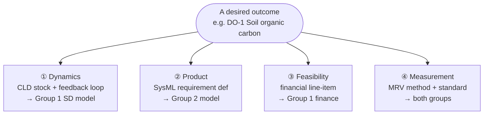
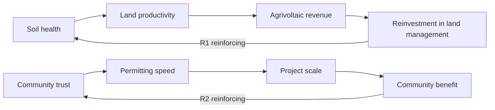

# Desired-Outcomes Interface

**Version:** 0.1 (2026-07-02) — structure proposed, target values TBD by the group
**Owner:** Regeneration Task-Force (jointly held by Group 1 and Group 2)
**Purpose:** The single shared list of what this system must regenerate. This is the contract between the two groups and the spine of the whole approach (Step 4 of `00-regenerative-design-approach.md`).

---

## How to read this

Each row is one **desired outcome** in Fischer et al.'s sense — something the system makes improve, repeatedly, over its life. Each outcome is used four ways, one per column block:

- **Dynamics (Group 1):** the stock it becomes in the System Dynamics model, and the dominant feedback loop that drives it.
- **Product (Group 2):** the SysML v2 `requirement def` that the model must satisfy, and the system function that produces it.
- **Feasibility (Group 1):** whether the outcome is bankable today, optionality, or a cost — and the financial line it touches.
- **Measurement (both):** the MRV method and verification standard (detailed in `../06-lca-and-financial/mrv-protocol.md`).

*One outcome, defined once, used four ways. This is why the list is the shared contract: change a row and all four uses must stay consistent.*

**The rule (from `CLAUDE.md`):** no outcome is traded off against another. All move in the positive direction, or the design is not regenerative.

**Status of targets:** the metrics and directions below are proposed. The **numeric targets and baselines are deliberately left as TBD** — setting them is a first-meeting job for the group, not something to assert here. Only the lifecycle-GHG target is anchored (it comes from the existing BM / IEA-PVPS Task 12).

---

## The outcomes (PV pilot: SolarX → SustainaSun)

| # | Desired outcome | Capital | Metric | Direction / target |
|---|---|---|---|---|
| DO-1 | Soil organic carbon | Natural | SOC % at fixed depth, bulk-density corrected | Stable or increasing over 10 yr (target TBD) |
| DO-2 | On-site biodiversity | Natural | Species richness vs. pre-installation baseline | Positive at Yr 10 (target TBD) |
| DO-3 | Water retention | Natural | Infiltration rate / runoff reduction | Improved vs. baseline (target TBD) |
| DO-4 | Material circularity | Manufactured | % high-value mass recovered at EOL (Si, Ag, glass) | ≥ target TBD; design-for-disassembly required |
| DO-5 | Lifecycle GHG intensity | Natural | gCO₂eq/kWh (verified EPD, full BoS) | **< 15 gCO₂eq/kWh** (anchored) |
| DO-6 | Community wealth retention | Social / Financial | Share of lifetime revenue retained locally | ≥ target TBD |
| DO-7 | Energy access | Social | Share of generation to designated users at discount | ≥ target TBD |
| DO-8 | Supplier decarbonization | Natural / Manufactured | Module supply-chain carbon intensity over time | Decreasing (target TBD) |

Rows DO-1…DO-8 are the proposed starting set. The group may add (e.g. human capital / local employment) or merge; keep the total at 8–10 so the interface stays manageable.

---

## The upward helix these outcomes ride on

The reason the outcomes must be modelled dynamically (not as static targets) is that the valuable ones sit on reinforcing loops. Two examples, drawn from DO-1 and DO-6:

*Each loop is an upward helix in Fischer's sense: partly self-perpetuating, but only while ongoing input (land management, community engagement) keeps it turning. Balancing loops (compliance overhead, market saturation, natural limits) cap them. Step 8 parameterizes these into the SD model.*

## The four uses, per outcome

### DO-1 — Soil organic carbon
- **Dynamics:** stock `SoilCarbon`; reinforcing loop *soil health → land productivity → agrivoltaic revenue → reinvestment in land management → soil health*; balancing at soil-type natural limit.
- **Product:** `requirement def SoilCarbonRequirement` → function *regenerative land management* (grazing/mowing timing, ground cover). Ecological flow: biomass → soil.
- **Feasibility:** non-bankable directly; acts as a lease-term lever and de-risks permitting. Cost line: O&M ecological management.
- **Measurement:** periodic soil sampling; EOV-aligned; independent lab. Baseline before installation.

### DO-2 — On-site biodiversity
- **Dynamics:** stock `SpeciesRichness`; loop *monitoring quality → credit credibility → credit price → monitoring investment* (emerging); balancing at habitat carrying capacity.
- **Product:** `requirement def BiodiversityRequirement` → function *manage habitat structure under array*. Flow: biological capital.
- **Feasibility:** deferred/optionality (biodiversity credit markets ~2028–30); today it de-risks permitting. Revenue line: biodiversity credits (Scenario C only).
- **Measurement:** transect surveys, pollinator/bird counts, TNFD-aligned; pre-installation baseline essential for attribution.

### DO-3 — Water retention
- **Dynamics:** stock `SoilMoisture` / retained-water; couples to DO-1 (moisture → biomass → carbon).
- **Product:** `requirement def WaterRetentionRequirement` → drainage/ground-cover design functions. Flow: water (infiltration, evapotranspiration).
- **Feasibility:** non-bankable; resilience/yield benefit. Cost line: civil design (low-disturbance).
- **Measurement:** infiltration measurement, runoff monitoring; site-specific baseline.

### DO-4 — Material circularity
- **Dynamics:** stock `RecoverableMaterialBank`; loop *installed base → EOL returns → reverse logistics → material bank → leasing-cost reduction* (from CLD R9); balancing at reverse-logistics capacity, reinforced by regulatory take-back (CLD B4).
- **Product:** `requirement def MaterialCircularityRequirement` → design-for-disassembly functions; EOL recovery pathway specified at design time. Flow: material recovery at EOL.
- **Feasibility:** long-dated, small NPV (8–12 k€/MW); strategic optionality + WEEE compliance, not load-bearing. Revenue line: EOL recovery; enabled by Digital Product Passport.
- **Measurement:** design-time recoverability spec; verified recovery rate at decommissioning.

### DO-5 — Lifecycle GHG intensity *(anchored target)*
- **Dynamics:** attribute driven by DO-8 (supplier decarbonization) and operation phase; feeds low-carbon premium.
- **Product:** `requirement def LifecycleGHGRequirement { attribute maxGHG = 15[g/kWh]; }` → module sourcing + EOL recovery functions.
- **Feasibility:** **bankable today** — drives the low-carbon attribute premium (2–5 €/MWh). Revenue line: low-carbon premium (M4).
- **Measurement:** verified EPD (EPD International / IBU), IEA-PVPS Task 12 methodology, full BoS.

### DO-6 — Community wealth retention
- **Dynamics:** stock `LocalWealth`; reinforcing loop *community trust → permitting speed → project scale → community benefit → trust* (CLD-linked).
- **Product:** `requirement def CommunityWealthRequirement` → community-ownership and local-procurement functions.
- **Feasibility:** **bankable / structural** — community equity (M5) lowers WACC ~50–100 bps ≈ 3 €/MWh. Capital-structure line.
- **Measurement:** revenue-flow accounting; procedural-justice indicators (not just bill savings — see dossier R9 caution).

### DO-7 — Energy access
- **Dynamics:** couples to DO-6 (access → trust → permitting).
- **Product:** `requirement def EnergyAccessRequirement` → local distribution / social-tariff functions.
- **Feasibility:** grant-dependent (1–3% NPV). Revenue line: community grant / social tariff (M7).
- **Measurement:** generation-share records, tariff records, designated-user access data.

### DO-8 — Supplier decarbonization
- **Dynamics:** slow reinforcing loop *low-carbon premium → sourcing pressure → supplier development → lower module carbon intensity → better EPD → higher premium*.
- **Product:** `requirement def SupplierCarbonRequirement` → procurement specification function.
- **Feasibility:** cost of engagement; indirect revenue via DO-5 premium eligibility. Cost line: procurement.
- **Measurement:** supplier EPD tracking over time; CBAM-relevant data.

---

## Interface change control

- This file is **jointly owned**. A change to any row must be visible to both groups before it lands.
- Group 1 owns the **target values, dynamics mapping, and feasibility columns**.
- Group 2 owns the **SysML requirement defs and functions columns**.
- The MRV columns are agreed jointly and detailed in `../06-lca-and-financial/mrv-protocol.md`.
- When a target value is set, replace "TBD" and note the source and date.

---

## Why this is the load-bearing artefact

`GAPS-AND-RISKS.md` §3 identified that the two groups had no defined interface, and §9 that the Fischer ontology was not integrated into the design work. This file resolves both: it is the interface, and it is organised by Fischer's "desired outcome" concept, so the ontology becomes the operating vocabulary rather than a diagram in a folder.
