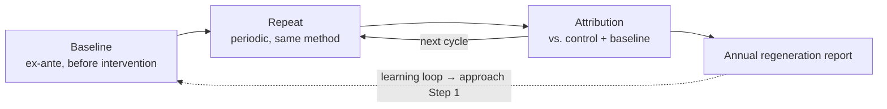
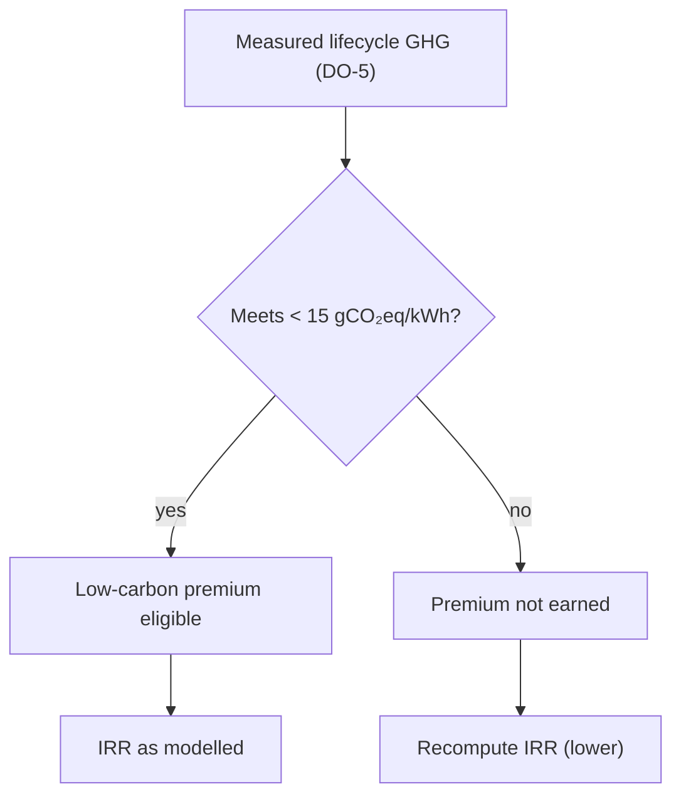

# MRV Protocol — Monitoring, Reporting, Verification

**Version:** 0.1 (2026-07-02) — structure and methods proposed; cadences and thresholds TBD by the group
**Owner:** Regeneration Task-Force (both groups)
**Purpose:** Make the regeneration claim falsifiable and auditable. This is Step 10 of `../03-methodology/00-regenerative-design-approach.md`. It turns each desired outcome in `../03-methodology/01-desired-outcomes-interface.md` into a measurable, verifiable, independently checkable protocol.

---

## Why this document exists

`../GAPS-AND-RISKS.md` §5 named MRV as "the weakest link everywhere": named outcomes, no measurement plan. Without MRV, a regenerative claim is an ex-post assertion with no baseline, and cannot be told apart from greenwashing. The Task-Force's credibility rests on this being real.

Fischer et al. (2024) make the same point structurally: regenerative dynamics are only *partly* self-perpetuating — they need ongoing input to be sustained. You cannot manage what you do not measure, and you cannot claim an upward helix without a baseline and a repeat.

---

## The measurement logic: baseline → repeat → attribution

Every outcome follows the same three-move logic, reused from the Danish readiness-assessment templates in `../_research/` (which already implement baseline → repeat administration → attribution of change):

1. **Baseline (ex-ante).** Measure the outcome *before* any intervention. Without this, no later change is attributable. For PV this means measuring soil, biodiversity, water, and community-wealth indicators before site preparation.
2. **Repeat (periodic).** Re-measure on a fixed cadence with the same method, comparators, and sampling design.
3. **Attribution.** Compare against a control/reference and the pre-installation baseline, so improvement is attributable to the design rather than to weather, time, or regional trend. Attribution is the move most regenerative claims skip (see dossier R7: pollinator studies lacking pre-installation baselines).

*The baseline is the one measurement you cannot take late: once a site is prepared, the pre-installation state is gone forever. This is why baselining for DO-1/DO-2/DO-3 is time-critical.*

---

## Protocol per desired outcome

Cadences and thresholds are proposed placeholders; the group sets the binding values when it sets the interface targets.

| Outcome | Method | Baseline | Cadence | Comparator | Verification standard | Data owner |
|---|---|---|---|---|---|---|
| DO-1 Soil organic carbon | Soil sampling, fixed depth, bulk-density corrected | Pre-installation | Annual → 3-yearly | Adjacent unmanaged plot | EOV (Land to Market) | Land-management partner |
| DO-2 Biodiversity | Transects; pollinator + bird counts | Pre-installation (essential) | Seasonal, ≥3 yr | Adjacent reference site | TNFD LEAP | Ecological monitor |
| DO-3 Water retention | Infiltration tests, runoff monitoring | Pre-installation | Annual | Pre vs. post, control plot | ISO 14046 (water footprint) | Civil / O&M |
| DO-4 Material circularity | Design-time recoverability spec; recovery rate at EOL | Design spec | Design gate + Yr 30 | Conventional module EOL (~80% mass, low-value) | WEEE, ISO 59020, Digital Product Passport | Recycler + provider |
| DO-5 Lifecycle GHG | Verified EPD, full BoS, IEA-PVPS Task 12 | EPD at procurement | Per procurement cycle | Conventional c-Si EU average | EPD International / IBU; ISO 14040/44 | Procurement |
| DO-6 Community wealth | Revenue-flow accounting; procedural-justice survey | Project start | Annual | Regional retention rate | Capitals Coalition Social Capital Protocol | Community governance body |
| DO-7 Energy access | Generation-share + tariff records | Project start | Annual | Designated-user access target | Internal + grant-body audit | Provider |
| DO-8 Supplier decarbonization | Supplier EPD tracking | First procurement | Annual | Baseline supplier intensity | SBTN; CBAM data | Procurement |

---

## Verification tiers

Not every outcome needs the same rigour. Match cost to consequence:

- **Tier 1 — Self-reported, documented.** Internal records, transparent method (DO-7 energy access, DO-6 revenue accounting).
- **Tier 2 — Standard-aligned, method-verifiable.** Follows a named external standard so a third party *could* check it (DO-5 EPD, DO-3 water, DO-8 supplier).
- **Tier 3 — Independently verified.** Third-party audit or accredited verifier, required where a market or a claim depends on it (DO-1 soil carbon if credited, DO-2 biodiversity if credited, DO-4 recovery rate).

An outcome may start at Tier 1–2 and move to Tier 3 when it becomes bankable (e.g. DO-2 when biodiversity credit markets mature ~2028–30).

---

## Reporting

- **Internal:** annual regeneration report per project, structured on the baseline → repeat → attribution logic. The Danish `D._Skabelon_Rapport_1.docx` (first cycle) and `E._Skabelon_Rapport_2.docx` (longitudinal comparison) templates are the reusable skeleton — repurpose their scored, two-axis, progress-tracking format into a regeneration scorecard.
- **External:** align disclosure to CSRD / ESRS double-materiality where the operator is in scope, and to TNFD for nature. Report against the *anchored* target (DO-5 < 15 gCO₂eq/kWh) and against direction-of-travel for the TBD outcomes.

---

## The financial–ecological reconciliation (the honesty check)

MRV closes the loop to feasibility. `GAPS-AND-RISKS.md` §5 asks: "who checks that the model's IRR assumptions are consistent with the ecological outcomes being claimed?" This protocol assigns that check:

- The measured DO-5 GHG figure must match the low-carbon premium assumed in the financial model. If measured GHG misses the threshold, the premium revenue is not eligible and the IRR must be recomputed.
- The measured DO-1/DO-2 outcomes must support any lease-term or permitting benefits claimed.
- Any biodiversity-credit revenue (DO-2, Scenario C) is contingent on Tier-3 verification actually being in place.

*The measured outcome gates the revenue. This one check is what makes the financial case honest: no verified performance, no premium, no inflated IRR.*

This reconciliation is the mechanism that upgrades the Task-Force thesis from asserted to demonstrated (`GAPS-AND-RISKS.md` §10): regeneration outperforms extraction only if the measured outcomes are real and the revenue that depends on them is therefore earned.

---

## First actions

1. Group sets binding cadences and thresholds when it sets the interface targets.
2. For the PV pilot, commission the **pre-installation baseline** for DO-1, DO-2, DO-3 — this is time-critical, because once a site is prepared the baseline is unrecoverable.
3. Convert the Danish report templates into the regeneration scorecard format.
4. Assign each data-owner role to a named Task-Force member or partner.
