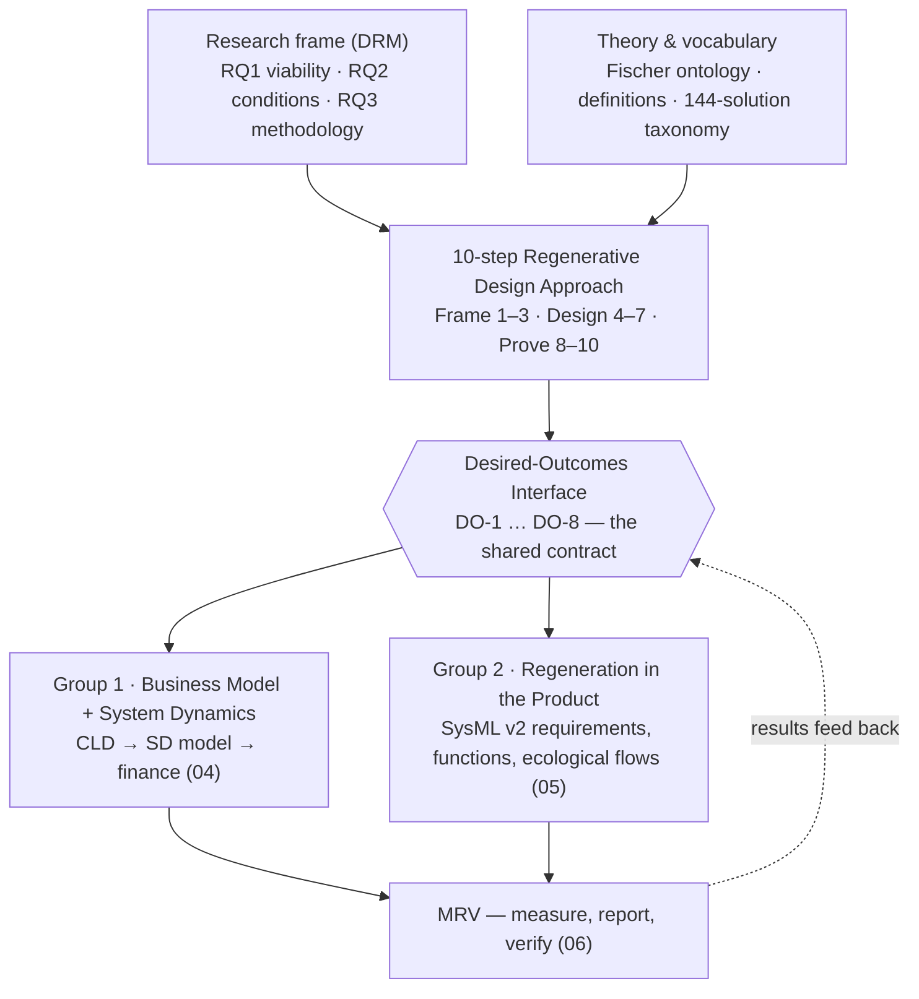

# Regeneration Task-Force — Working Space

**Initiative:** INCOSE / GfSE Sustainability Working Group · SustainableTogether Project
**Lead:** Hamza Bassam
**Status:** Kicked off 2026-07-06 · [Project board](https://github.com/users/TheNightFox-1/projects/5) · [Milestone: Regeneration TF — Cycle 1](https://github.com/TheNightFox-1/SustainableTogether/milestone/4) · Issues [#26–#39](https://github.com/TheNightFox-1/SustainableTogether/issues?q=is%3Aissue+label%3Aregeneration)

---

## Mission

Make regeneration the operational norm for engineered systems by proving — in a real model — that designing for regenerative outcomes is commercially viable. Not just reducing harm: actively healing ecological, social, and economic systems through normal commercial operation.

**Pilot case:** SolarX (conventional PV company, AS-IS) → SustainaSun (regenerative future state).
**Theoretical anchor:** Fischer et al. (2024), "Mainstreaming regenerative dynamics for sustainability", *Nature Sustainability* 7, 964–972 — regeneration as an "upward helix": partly self-perpetuating, but needing ongoing input.

---

## Start here (reading order for newcomers)

1. This README — the map
2. `00-foundations/RC-research-clarification.md` — the three research questions and success criteria (locked)
3. `03-methodology/00-regenerative-design-approach.md` — the 10-step method (Frame → Design → Prove)
4. `03-methodology/01-desired-outcomes-interface.md` — **the spine**: the 8 desired outcomes both groups work from
5. `GAPS-AND-RISKS.md` — the honest devil's-advocate view of what is still missing

---

## How it all hangs together

Each desired outcome (soil carbon, biodiversity, water retention, material circularity, lifecycle GHG, community wealth, energy access, supplier decarbonization) is defined **once** in the interface and used **four ways**: as a CLD stock (dynamics), a SysML `requirement def` (product), a financial line (feasibility), and an MRV target (measurement). That single list is what keeps the two groups' artefacts interlocking.

---

## The research questions

| RQ | Question | Answered by |
|---|---|---|
| **RQ1 — Viability (gate)** | Can a regenerative PV business model reach positive NPV and IRR ≥ 8% over 30 years without subsidy dependency? | Group 1 ([#27](https://github.com/TheNightFox-1/SustainableTogether/issues/27), [#30](https://github.com/TheNightFox-1/SustainableTogether/issues/30)) |
| **RQ2 — Conditions** | Under which structural, regulatory, and market conditions does regenerative outperform conventional, risk-adjusted? "Better when…", not "always better". | Group 1 ([#28](https://github.com/TheNightFox-1/SustainableTogether/issues/28), [#29](https://github.com/TheNightFox-1/SustainableTogether/issues/29), [#30](https://github.com/TheNightFox-1/SustainableTogether/issues/30)) |
| **RQ3 — Methodology** | How can ecological, social, and economic outcomes be co-optimised via an integrated method linking BM, product architecture, and dynamic modelling? | Both groups ([#31](https://github.com/TheNightFox-1/SustainableTogether/issues/31), [#32](https://github.com/TheNightFox-1/SustainableTogether/issues/32)) |

Full detail: `00-foundations/RC-research-clarification.md` (DRM: RC ✓ → DS-I → PS → DS-II → writing).

---

## The two working groups

### Group 1 — Business Model + System Dynamics (`04-business-model/`)
**Mandate:** demonstrate that regeneration is commercially viable — and under which structural conditions.
**Starting assets:** SustainaSun BM v0.1 · built financial model (7 sheets, 3 scenarios, equity IRR ~8–10.5%) · CLD v2/v3 (leasing) · FBMC↔CLD concept registry + validation pipeline.
**First work:** confirm the revenue architecture of the new regenerative-dynamics BM (#27), reconcile the CLD with it (#28), then parameterize the SD model (#29).

### Group 2 — Regeneration in the Product (`05-product-regeneration/`)
**Mandate:** formalize regenerative design in MBSE/SysML v2 — what a regenerative product *is* and how to engineer it from requirements to architecture.
**Starting assets:** SolarX SysML v2 model (physical architecture complete) · proposed `requirement def` per outcome in the interface · 144-solution taxonomy and five-mechanisms catalogue.
**First work:** define the ~5 regenerative system functions (#31), then extend the model with regenerative requirements and ecological flows (#32).

---

## Where we stand (2026-07-06)

### Done
- Definitions compendium (15 domains) and 144-solution taxonomy — `00-foundations/`
- Fischer regenerative-dynamics ontology (interactive HTML) — `01-theory-and-ontology/`
- Strategic framework "From Extraction to Regeneration" — `02-strategic-framework/`
- Research Clarification with RQ1–RQ3 and success criteria C1–C8, **locked** — `00-foundations/`
- PV research dossier (9 topics) — `03-methodology/pv-case-study/`
- Financial model, built and reviewed — `04-business-model/business-model/`
- FBMC↔CLD semantic-alignment method with concept registry and automated validation pipeline — `04-business-model/system-dynamics/`

### Drafted — awaiting group decisions
- 10-step Regenerative Design Approach (v0.1)
- Desired-Outcomes Interface DO-1…DO-8 — **numeric targets and baselines TBD** ([#26](https://github.com/TheNightFox-1/SustainableTogether/issues/26)); only the lifecycle-GHG target (< 15 gCO₂eq/kWh) is anchored
- MRV protocol (#35) · REFERENCE/IMPACT models · PRISMA literature review underway (#33)

### Not started
- New regenerative-dynamics business model (#27) and reconciled CLD (#28)
- System Dynamics model (#29) — highest-priority missing artefact
- Regenerative SysML v2 layer (#31, #32)
- Regenerative-scenario LCA (#34) · risk-adjusted baseline comparison (#30)
- Governance (#37) and PhD/action-research declaration (#36)

---

## Tracking the work

- **[Project board — Regeneration Task-Force](https://github.com/users/TheNightFox-1/projects/5)** · all work items are GitHub issues labelled [`regeneration`](https://github.com/TheNightFox-1/SustainableTogether/issues?q=is%3Aissue+label%3Aregeneration), milestone **Regeneration TF — Cycle 1**
- Group labels: `group-1-bm-sd`, `group-2-product`; cross-cutting: `research`, `governance`, `lca-model`, `infrastructure`
- Issues labelled `needs-discussion` require a Task-Force decision before work starts
- To contribute: pick an unassigned issue on the board, comment to claim it, work on a branch, open a PR (see repo `CONTRIBUTING` conventions)

---

## Folder map

| Folder | Contents |
|---|---|
| `00-foundations/` | Research clarification (RQs), REFERENCE/IMPACT models, solution taxonomy, definitions compendium |
| `01-theory-and-ontology/` | Regeneration ontology (HTML) and core literature |
| `02-strategic-framework/` | "From Extraction to Regeneration" — strategic and consulting framework |
| `03-methodology/` | 10-step approach, desired-outcomes interface, diagrams, PV case study |
| `04-business-model/` | Group 1: business model, financial model, CLD, concept registry + pipeline |
| `05-product-regeneration/` | Group 2: MBSE/SysML v2 integration |
| `06-lca-and-financial/` | Cross-group: LCA integration, MRV protocol |
| `_research/` | PRISMA strategy, literature-review logs, survey instruments (repurposed for MRV) |
| `_archive/` | Superseded documents kept for reference |

Housekeeping (backup folders, duplicates, `PhD/` location) is tracked in [#39](https://github.com/TheNightFox-1/SustainableTogether/issues/39).

---

## Key references

- Fischer, Farny, Abson et al. (2024) — "Mainstreaming regenerative dynamics for sustainability", *Nature Sustainability* 7, 964–972 — the theoretical anchor
- Schaltegger et al. (2015) — Business models for sustainability: origin, present, future
- Das & Bocken (2024) — Regenerative business strategies
- Blessing & Chakrabarti (2009) — *Design Research Methodology* (the DRM research frame)
- "From Extraction to Regeneration" (Bassam, 2026) — the strategic framework document

---

## Related

- SolarX MBSE model: `../System Model/SolarX/`
- Repo: [`TheNightFox-1/SustainableTogether`](https://github.com/TheNightFox-1/SustainableTogether) · INCOSE/GfSE WG materials in the parent folder
