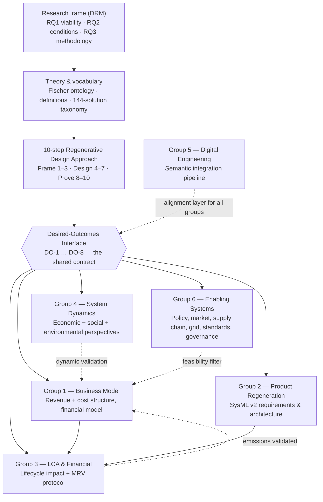

# Regeneration Task-Force — Working Space

**Initiative:** INCOSE (International Council on Systems Engineering) / GfSE (Gesellschaft für Systems Engineering) Sustainability Working Group · SustainableTogether Project
**Lead:** Hamza Bassam
**Status:** Kicked off 2026-07-06 · [Project board](https://github.com/users/TheNightFox-1/projects/5) · [Milestone: Regeneration TF — Cycle 1](https://github.com/TheNightFox-1/SustainableTogether/milestone/4) · Issues [#26–#39](https://github.com/TheNightFox-1/SustainableTogether/issues?q=is%3Aissue+label%3Aregeneration)

> **Two reference documents you will need:**
> [`GLOSSARY.md`](GLOSSARY.md) — every abbreviation used in this workspace, expanded.
> [`RQ-DECOMPOSITION.md`](RQ-DECOMPOSITION.md) — how the three research questions break down into the six groups, and the rules by which the sub-answers compose into an answer.

---

## What this is

A research task-force proving — in a real MBSE model with a working business model and life-cycle assessment — that a solar-PV company can be redesigned to **actively heal** ecological, social, and economic systems through normal commercial operation, *and still be more viable than the extractive version it replaces*. The pilot case runs a conventional PV company (**SolarX**, as-is) forward into a regenerative future state (**SustainaSun**).

**Theoretical anchor:** Fischer et al. (2024), "Mainstreaming regenerative dynamics for sustainability", *Nature Sustainability* 7, 964–972 — regeneration as an "upward helix": an outcome that improves repeatedly, is partly self-perpetuating, but needs ongoing input to keep rising.

---

## Why it exists (the problem)

Conventional solar PV — for all its low-carbon electricity — still runs on **degenerative dynamics**:

- **Linear material flow:** raw materials → product → waste, with 50–70% mass recovery at end-of-life and no circular design.
- **Externalised costs:** ecological and social costs sit outside the financial model.
- **Value extraction:** most lifetime revenue leaves the host community; engagement is transactional.
- **Mono-use land:** ground sealed under panels, soil and biodiversity treated as a cost, not an asset.
- **Single revenue stream:** electricity sales only — no value captured from ecological or social outcomes.

"Do no harm" is not enough. The question this task-force exists to answer is whether an engineered system can move from *reducing harm* to *actively regenerating* — and pay for itself doing so.

---

## The thesis

The one falsifiable claim the whole project tests.

**Primary claim.**
A photovoltaic business designed for **regenerative outcomes** — one that measurably increases soil carbon, on-site biodiversity, community wealth, and material circularity through *normal commercial operation* — can reach **positive NPV and IRR ≥ 8% over a 30-year lifecycle without subsidy dependency**, and can match or beat a conventional PV baseline on **risk-adjusted** returns under identifiable market and regulatory conditions.

> **NPV — Net Present Value:** the sum of all future cash flows (in and out) discounted back to today's money. NPV > 0 means the project earns more than the discount rate demanded, i.e. it creates value. **IRR — Internal Rate of Return:** the annualised discount rate at which NPV would equal zero — effectively the project's own rate of return. An IRR ≥ 8% means the project clears the return bar typical for utility-scale PV. Both are computed over the 30-year lifecycle; "without subsidy dependency" means the result must hold when public subsidies are removed from the cash flows.

**Method sub-claim (RQ3).**
These ecological, social, and economic outcomes can be **co-optimised, not traded off**, using an integrated method that links the business model, System Dynamics (SD), Model-Based Systems Engineering (MBSE) in SysML v2, and Monitoring, Reporting and Verification (MRV) through a single shared **desired-outcomes interface**.

**What would falsify it.**
- If the regenerative model cannot clear the **financial gate** (RQ1: NPV > 0, IRR ≥ 8%, unsubsidised), the thesis fails *regardless* of ecological or social merit.
- If it clears the gate only by **trading one capital against another** (e.g. profit at the cost of biodiversity), it fails the regeneration test.
- If the reinforcing loops **do not compound** in the System Dynamics model over 30 years (C7), the "upward helix" claim is unsupported.

---

## The research questions

| RQ | Question |
|---|---|
| **RQ1 — Viability (gate)** | Can a regenerative PV business model reach positive NPV and IRR ≥ 8% over 30 years without subsidy dependency? |
| **RQ2 — Conditions** | Under which structural, regulatory, and market conditions does regenerative outperform conventional, risk-adjusted? "Better when…", not "always better". |
| **RQ3 — Methodology** | How can ecological, social, and economic outcomes be co-optimised via an integrated method linking BM, product architecture, and dynamic modelling? |

**RQ1 is a hard gate.** It is answered first; if regeneration cannot stand on its own financially, RQ2 and RQ3 are moot. Full detail: `00-foundations/RC-research-clarification.md` (DRM: RC ✓ → DS-I → PS → DS-II → writing).

### How the RQs break down across groups

Each top-level RQ is answered by the **combined output** of several groups. No single group can answer one alone. Each RQ is split into sub-questions with one accountable owner, one named artefact, and one acceptance test — and each has a **roll-up rule** stating exactly how the sub-answers compose into the parent answer.

**The full tree, the roll-up rules, and the evidence ledger live in [`RQ-DECOMPOSITION.md`](RQ-DECOMPOSITION.md).** Summary:

| RQ | Lead group | Contributing groups | The answer is… |
|---|---|---|---|
| **RQ1 — Viability** | Group 1 Business Model (RQ1.1) | G2 Product (costs) · G3 LCA (emissions) · G6 Enabling Systems (bankability) · G4 System Dynamics (stability) · G5 Digital Engineering (consistency) | The financial model clearing NPV > 0 and IRR ≥ 8% unsubsidised, using **only** inputs that passed the other five groups' tests |
| **RQ2 — Conditions** | Group 6 Enabling Systems (RQ2.1) | G1 Business Model (sensitivity) · G4 System Dynamics (persistence) · G3 LCA (conditional impact) · G2 Product (design contingency) | A set of "better when {condition}" statements, where each condition is named by G6, shown financially decisive by G1, **and** shown to persist over 30 yr by G4 |
| **RQ3 — Methodology** | Group 5 Digital Engineering (RQ3.1) | G1 Business Model · G2 Product · G4 System Dynamics · G3 LCA/MRV · G6 Enabling Systems | A completed **DO × Use matrix**: all eight desired outcomes traversing all four uses (CLD stock · SysML requirement · financial line · MRV method) with every link machine-validated |

Three rules govern the roll-up:

- **RQ1 is a hard gate.** It is answered first. If regeneration cannot stand financially, RQ2 and RQ3 are moot.
- **A missing input means *unanswered*, not *no*.** An unanswered gate means more work; a negative answer means the thesis is falsified. The two are never reported as the same thing.
- **Roll-up rules are not weakened to make an answer reachable.** "We could not verify this" is a legitimate research result and gets published alongside what was verified.

**Where we actually stand:** RQ1 has one of its six inputs partially in place. No top-level RQ is close to answerable yet — see the evidence ledger in [`RQ-DECOMPOSITION.md`](RQ-DECOMPOSITION.md#evidence-ledger).

---

## Success criteria

How we know the thesis is proven (or not). Full detail and targets in `00-foundations/RC-research-clarification.md`.

| # | Criterion | Measure | Target |
|---|---|---|---|
| C1 | Financial viability | NPV at 7% discount over 30 yr | NPV > 0 (RQ1) |
| C2 | Acceptable return | IRR vs. PV benchmark | IRR ≥ 8% (RQ1) |
| C3 | Risk-adjusted comparison | Risk-adjusted IRR vs. SolarX baseline | Identify conditions (RQ2) |
| C4 | Ecological improvement | Lifecycle GHG reduction; measurable biodiversity gain | Per DO-1,2,3,5 |
| C5 | Social value | Community wealth retention; energy-access coverage | Per DO-6,7 |
| C6 | Methodological validity | 10-step approach replicated | ≥ 2 contexts (RQ3) |
| C7 | Dynamic proof | SD model shows compounding reinforcing loops | Over 30 yr (RQ3) |
| C8 | MRV feasibility | Measurement protocol is field-testable | Per mrv-protocol |

---

## Scope & boundaries

**In scope:** the SolarX → SustainaSun **PV pilot**, a 30-year horizon, the 8 desired outcomes (DO-1…DO-8), demonstrated through a *modeled* system (business model + system dynamics + SysML v2 + LCA + MRV), and a risk-adjusted comparison against a conventional baseline.

**Explicitly out of scope (this cycle):**

| Not doing | Because |
|---|---|
| Building physical hardware / a real plant | This is a model-and-evidence demonstration, not a deployment. |
| Multi-year primary field measurement | MRV delivers a **protocol + field-test plan**, not longitudinal soil/biodiversity data. |
| Validating the method beyond PV | Written generic-first, but *validated* only on the PV pilot; other sectors (C6, "≥2 contexts") are future work. |
| Investment-grade due diligence | The financial model is a **research-grade demonstrator**, not an investor prospectus. |
| Issuing / certifying credits (biodiversity, carbon) | We model their *effect* on the business case; we don't transact or certify. |
| Policy advocacy / lobbying | We *identify* enabling conditions (RQ2); we don't campaign for them. |
| New ecological science | We apply and critique existing science; we don't run ecological experiments. |
| Rebuilding the SolarX AS-IS model | Already complete — Group 2 *extends* it, doesn't redo it. |

---

## Core concepts (the minimum vocabulary)

Everything in this workspace is written in the vocabulary of Fischer et al. (2024). Five terms unlock the rest:

- **Desired outcome** — something the system makes *improve, repeatedly, over its life* (soil carbon, biodiversity, community wealth…). The **unit of design**: we design for outcomes, not features. The eight of them live in the desired-outcomes interface.
- **Regenerative dynamics / upward helix** — an outcome that rises repeatedly, is partly self-perpetuating (endogenous momentum), but still needs ongoing energy, labour, and materials, and stops rising at natural limits. Because it is a *behaviour over time*, it must be modelled dynamically (System Dynamics), not as a static target.
- **Restoration ≠ regeneration** — fixing damage once (exogenous) is a *prerequisite*; regeneration means the system then **sustains and renews** the outcome through normal operation (endogenous).
- **Triple Top Line** — Economy + Ecology + Equity, all positive. No outcome is **traded off** against another, or the design is not regenerative.
- **Five capitals** — natural, human, social, manufactured, financial. The design models value *flowing across all five*, not accumulating in one.

Interactive ontology: `01-theory-and-ontology/regenerative-dynamics-ontology.html`.

---

## Start here (reading order for newcomers)

1. This README — the map
2. [`GLOSSARY.md`](GLOSSARY.md) — the abbreviations. Read it once; everything else becomes legible
3. [`00-foundations/RC-research-clarification.md`](00-foundations/RC-research-clarification.md) — the three research questions and success criteria (locked)
4. [`RQ-DECOMPOSITION.md`](RQ-DECOMPOSITION.md) — how those questions break into the six groups, and what counts as an answer
5. [`03-methodology/00-regenerative-design-approach.md`](03-methodology/00-regenerative-design-approach.md) — the 10-step method (Frame → Design → Prove)
6. [`03-methodology/01-desired-outcomes-interface.md`](03-methodology/01-desired-outcomes-interface.md) — **the spine**: the 8 desired outcomes every group works from
7. [`GAPS-AND-RISKS.md`](GAPS-AND-RISKS.md) — the honest devil's-advocate view of what is still missing
8. Your group's `TASK-BRIEF.md`, in your group folder

---

## How it all hangs together

Each desired outcome (soil carbon, biodiversity, water retention, material circularity, lifecycle GHG, community wealth, energy access, supplier decarbonization) is defined **once** in the interface and used **four ways**: as a CLD stock (dynamics), a SysML `requirement def` (product), a financial line (feasibility), and an MRV target (measurement). That single list is what keeps six groups' artefacts interlocking — and a completed version of it is the evidence that answers RQ3.

---

## The six working groups

The 2026-08-09 restructure split the original two groups into six. **Group numbers are unique and stable** — always refer to a group by number *and* name. Each group has a `TASK-BRIEF.md` in its folder stating the sub-questions it owns.

| Group | Name | Folder | Mandate | Owns |
|---|---|---|---|---|
| **Group 1** | Business Model | [`04-business-model/`](04-business-model/) | Design the regenerative PVaaS business model and prove it is viable without subsidy dependency | RQ1.1 ★ · RQ2.2 · RQ3.2 |
| **Group 2** | Product Regeneration | [`05-product-regeneration/`](05-product-regeneration/) | Formalise regeneration in SysML v2 — requirements, architecture, ecological flows | RQ1.2 · RQ2.5 · RQ3.3 |
| **Group 3** | LCA & Financial Integration | [`06-lca-and-financial/`](06-lca-and-financial/) | Quantify lifecycle impact, close the loop back into the financial model, own the MRV protocol | RQ1.3 · RQ2.4 · RQ3.5 |
| **Group 4** | System Dynamics | [`06-system-dynamics/`](06-system-dynamics/) | Model behaviour over time across economic, social and environmental perspectives | RQ1.5 · RQ2.3 · RQ3.4 |
| **Group 5** | Digital Engineering | [`07-digital-engineering/`](07-digital-engineering/) | Provide and validate the semantic bridge between all artefacts | RQ1.6 · RQ3.1 ★ |
| **Group 6** | Enabling Systems | [`08-enabling-systems/`](08-enabling-systems/) | Map the external conditions the model depends on and test them against reality | RQ1.4 · RQ2.1 ★ · RQ3.6 |

★ = leads that research question.

> **Folder numbering note.** Groups 3 and 4 both live under a folder prefixed `06-` — a leftover from the restructure. The **group number is the authoritative identifier**; folder prefixes are not.

**Where each group starts**

- **Group 1** — confirm the PVaaS revenue architecture ([#27](https://github.com/TheNightFox-1/SustainableTogether/issues/27)), then recast the financial model. Starting assets: SustainaSun BM v0.1, built financial model (7 sheets, 3 scenarios, equity IRR ~8–10.5%).
- **Group 2** — define the ~5 regenerative system functions ([#31](https://github.com/TheNightFox-1/SustainableTogether/issues/31)), then extend the SolarX model with regenerative requirements and ecological flows ([#32](https://github.com/TheNightFox-1/SustainableTogether/issues/32)).
- **Group 3** — define the LCA system boundary for the regenerative scenario, then extend the openLCA pipeline beyond the motor proof-of-concept ([#34](https://github.com/TheNightFox-1/SustainableTogether/issues/34)).
- **Group 4** — build the three perspective CLDs, then integrate ([#29](https://github.com/TheNightFox-1/SustainableTogether/issues/29)). Starting assets: CLD v2/v3 and the concept registry, in `07-digital-engineering/`.
- **Group 5** — extend the existing FBMC↔CLD registry and validation pipeline to cover SysML v2.
- **Group 6** — map the six categories of enabling systems, but **start after Group 1 confirms the revenue architecture** — which enabling systems matter depends on which revenue lines are load-bearing.

---

## Where we stand (2026-08-11)

### Done
- Definitions compendium (15 domains) and 144-solution taxonomy — `00-foundations/`
- Fischer regenerative-dynamics ontology (interactive HTML) — `01-theory-and-ontology/`
- Fischer et al. (2024) anchor paper filed — `01-theory-and-ontology/`
- Strategic framework "From Extraction to Regeneration" — `02-strategic-framework/`
- Research Clarification with RQ1–RQ3 and success criteria C1–C8, **locked** — `00-foundations/`
- REFERENCE (as-is) and IMPACT (to-be) models — `00-foundations/`
- PV research dossier (9 topics) — `03-methodology/pv-case-study/`
- Financial model, built and reviewed — `04-business-model/business-model/`
- FBMC↔CLD semantic-alignment method with concept registry and automated validation pipeline — `07-digital-engineering/`
- PRISMA search strategy + literature-review search logs — `_research/`
- Glossary and RQ decomposition with roll-up rules — this folder
- Task briefs for all six groups — one per group folder

### Drafted — awaiting group decisions
- 10-step Regenerative Design Approach (v0.1)
- Desired-Outcomes Interface DO-1…DO-8 — **numeric targets and baselines TBD** ([#26](https://github.com/TheNightFox-1/SustainableTogether/issues/26)); only the lifecycle-GHG target (< 15 gCO₂eq/kWh) is anchored
- MRV protocol (#35) · PRISMA literature review underway (#33)

### Not started
- New regenerative-dynamics business model (#27) and reconciled CLD (#28)
- System Dynamics model (#29) — highest-priority missing artefact
- Regenerative SysML v2 layer (#31, #32)
- Regenerative-scenario LCA (#34) · risk-adjusted baseline comparison (#30)
- Governance (#37) and PhD/action-research declaration (#36)

---

## Tracking the work

- **[Project board — Regeneration Task-Force](https://github.com/users/TheNightFox-1/projects/5)** · all work items are GitHub issues labelled [`regeneration`](https://github.com/TheNightFox-1/SustainableTogether/issues?q=is%3Aissue+label%3Aregeneration), milestone **Regeneration TF — Cycle 1**
- Group labels: `group-1-bm-sd`, `group-2-product`; cross-cutting: `research`, `governance`, `lca-model`, `infrastructure`
- Issues labelled `needs-discussion` require a Task-Force decision before work starts
- **Blocked-by chain:** setting the numeric DO targets ([#26](https://github.com/TheNightFox-1/SustainableTogether/issues/26)) gates the System Dynamics parameterization (#29), the business-model pricing (#27/#30), and the MRV thresholds (#35) — so **#26 is the first agenda item**, not a parallel task.
- To contribute: pick an unassigned issue on the board, comment to claim it, work on a branch, open a PR (see repo `CONTRIBUTING` conventions)

---

## Folder map

| Path | Contents |
|---|---|
| `README.md` | This file — the map |
| `GLOSSARY.md` | Every abbreviation used in this workspace |
| `RQ-DECOMPOSITION.md` | RQ tree, roll-up rules, evidence ledger, DO × Use matrix |
| `GAPS-AND-RISKS.md` | Devil's-advocate view of what is still missing |
| `STATUS.md` | Session state and open decisions |
| `CLAUDE.md` | Context and style rules for AI-assisted work in this folder |
| `00-foundations/` | Research clarification (RQs), REFERENCE/IMPACT models, solution taxonomy, definitions compendium |
| `01-theory-and-ontology/` | Regeneration ontology (HTML) and core literature |
| `02-strategic-framework/` | "From Extraction to Regeneration" — strategic and consulting framework |
| `03-methodology/` | 10-step approach, desired-outcomes interface, diagrams, PV case study |
| `04-business-model/` | **Group 1** — business model, financial model, IVIO ontology work |
| `05-product-regeneration/` | **Group 2** — MBSE / SysML v2 integration |
| `06-lca-and-financial/` | **Group 3** — LCA integration, MRV protocol |
| `06-system-dynamics/` | **Group 4** — perspective CLDs, integrated CLD, loop analysis |
| `07-digital-engineering/` | **Group 5** — semantic integration method, concept registry, validation pipeline, ontology |
| `08-enabling-systems/` | **Group 6** — policy, market, supply chain, grid, standards, governance conditions |
| `_research/` | PRISMA strategy, literature-review logs, survey instruments (repurposed for MRV) |
| `_archive/` | Superseded documents kept for reference |

Each group folder holds a `README.md` (what the group is) and a `TASK-BRIEF.md` (what it must deliver, and the sub-questions it owns).

Housekeeping (backup folders, duplicates, `PhD/` location) is tracked in [#39](https://github.com/TheNightFox-1/SustainableTogether/issues/39).

---

## Key references

- Fischer, Farny, Abson et al. (2024) — "Mainstreaming regenerative dynamics for sustainability", *Nature Sustainability* 7, 964–972 — the theoretical anchor
- Schaltegger et al. (2015) — Business models for sustainability: origin, present, future
- Das & Bocken (2024) — Regenerative business strategies
- Blessing & Chakrabarti (2009) — *Design Research Methodology* (the DRM research frame)
- "From Extraction to Regeneration" (Bassam, 2026) — the strategic framework document

---

## Related

- SolarX MBSE model: `../System Model/SolarX/`
- Repo: [`TheNightFox-1/SustainableTogether`](https://github.com/TheNightFox-1/SustainableTogether) · INCOSE/GfSE WG materials in the parent folder
