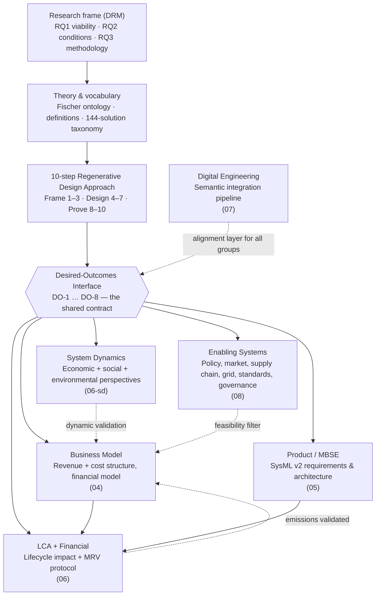

# Regeneration Task-Force — Working Space

**Initiative:** INCOSE / GfSE Sustainability Working Group · SustainableTogether Project
**Lead:** Hamza Bassam
**Status:** Kicked off 2026-07-06 · [Project board](https://github.com/users/TheNightFox-1/projects/5) · [Milestone: Regeneration TF — Cycle 1](https://github.com/TheNightFox-1/SustainableTogether/milestone/4) · Issues [#26–#39](https://github.com/TheNightFox-1/SustainableTogether/issues?q=is%3Aissue+label%3Aregeneration)

---

## What this is

A research task-force proving — in a real MBSE model with a working business model and life-cycle assessment — that a solar-PV company can be redesigned to **actively heal** ecological, social, and economic systems through normal commercial operation, *and still be more viable than the extractive version it replaces*. The pilot case runs a conventional PV company (**SolarX**, as-is) forward into a regenerative future state (**SustainaSun**).

**Theoretical anchor:** Fischer et al. (2024), "Mainstreaming regenerative dynamics for sustainability", *Nature Sustainability* 7, 964–972 — regeneration as an "upward helix": an outcome that improves repeatedly, is partly self-perpetuating, but needs ongoing input to keep rising.

---

## Why it exists (the problem)

Conventional solar PV — for all its low-carbon electricity — still runs on **degenerative dynamics**:

- **Linear material flow:** raw materials → product → waste, with 50–70% mass recovery at end-of-life and no circular design.
- **Externalised costs:** ecological and social costs sit outside the financial model.
- **Value extraction:** most lifetime revenue leaves the host community; engagement is transactional.
- **Mono-use land:** ground sealed under panels, soil and biodiversity treated as a cost, not an asset.
- **Single revenue stream:** electricity sales only — no value captured from ecological or social outcomes.

"Do no harm" is not enough. The question this task-force exists to answer is whether an engineered system can move from *reducing harm* to *actively regenerating* — and pay for itself doing so.

---

## The thesis

The one falsifiable claim the whole project tests.

**Primary claim.**
A photovoltaic business designed for **regenerative outcomes** — one that measurably increases soil carbon, on-site biodiversity, community wealth, and material circularity through *normal commercial operation* — can reach **positive NPV and IRR ≥ 8% over a 30-year lifecycle without subsidy dependency**, and can match or beat a conventional PV baseline on **risk-adjusted** returns under identifiable market and regulatory conditions.

> **NPV — Net Present Value:** the sum of all future cash flows (in and out) discounted back to today's money. NPV > 0 means the project earns more than the discount rate demanded, i.e. it creates value. **IRR — Internal Rate of Return:** the annualised discount rate at which NPV would equal zero — effectively the project's own rate of return. An IRR ≥ 8% means the project clears the return bar typical for utility-scale PV. Both are computed over the 30-year lifecycle; "without subsidy dependency" means the result must hold when public subsidies are removed from the cash flows.

**Method sub-claim (RQ3).**
These ecological, social, and economic outcomes can be **co-optimised, not traded off**, using an integrated method that links business model, system dynamics, MBSE/SysML, and MRV through a single shared **desired-outcomes interface**.

**What would falsify it.**
- If the regenerative model cannot clear the **financial gate** (RQ1: NPV > 0, IRR ≥ 8%, unsubsidised), the thesis fails *regardless* of ecological or social merit.
- If it clears the gate only by **trading one capital against another** (e.g. profit at the cost of biodiversity), it fails the regeneration test.
- If the reinforcing loops **do not compound** in the System Dynamics model over 30 years (C7), the "upward helix" claim is unsupported.

---

## The research questions

| RQ | Question |
|---|---|
| **RQ1 — Viability (gate)** | Can a regenerative PV business model reach positive NPV and IRR ≥ 8% over 30 years without subsidy dependency? |
| **RQ2 — Conditions** | Under which structural, regulatory, and market conditions does regenerative outperform conventional, risk-adjusted? "Better when…", not "always better". |
| **RQ3 — Methodology** | How can ecological, social, and economic outcomes be co-optimised via an integrated method linking BM, product architecture, and dynamic modelling? |

**RQ1 is a hard gate.** It is answered first; if regeneration cannot stand on its own financially, RQ2 and RQ3 are moot. Full detail: `00-foundations/RC-research-clarification.md` (DRM: RC ✓ → DS-I → PS → DS-II → writing).

### How the RQs break down across groups

Each top-level RQ is answered by the **combined output** of multiple groups. No single group can answer an RQ alone.

#### RQ1 — Viability (NPV > 0, IRR ≥ 8%, unsubsidised)

| Group | Contribution | Output that feeds RQ1 |
|---|---|---|
| **Business Model** (04) | *Leads.* Designs the PVaaS BM with revenue architecture and cost structure; builds the financial model. | NPV, IRR, payback, sensitivity across ≥3 scenarios |
| **Product** (05) | Defines the regenerative system functions and architecture — what the system physically *is* and what it costs to build. | CAPEX inputs, system boundaries, component list for financial model |
| **LCA** (06) | Quantifies the lifecycle environmental impact (gCO₂eq/kWh). If low-carbon premium is a revenue line, LCA validates the claim. | Verified emissions figure → validates or invalidates the low-carbon premium revenue line |
| **Enabling Systems** (08) | Identifies which revenue lines are realistic (e.g., can biodiversity credits actually be sold?) vs. hypothetical. | Filters revenue lines: bankable today / needs enabling system / speculative |
| **System Dynamics** (06-sd) | Validates that the financial projections are dynamically stable over 30 years — not just an accounting snapshot. | Confirms or flags dynamic instability in revenue/cost assumptions |
| **Digital Engineering** (07) | Ensures semantic consistency between the BM, CLD, and financial model — no contradictions in the artefacts. | Confidence that all artefacts describe the *same* system |

**The answer to RQ1 =** BM financial model, with inputs validated by Product (CAPEX), LCA (emissions), Enabling Systems (market reality), and SD (dynamic stability).

#### RQ2 — Conditions ("better when…")

| Group | Contribution | Output that feeds RQ2 |
|---|---|---|
| **Enabling Systems** (08) | *Leads.* Maps the full landscape of policy, market, supply chain, grid, standards, and governance conditions. | Classification matrix (blocker / enabler / amplifier) + feasibility assessment |
| **Business Model** (04) | Runs sensitivity analysis on the financial model to identify which conditions change the outcome. | Sensitivity analysis: which parameters make regenerative win or lose? |
| **System Dynamics** (06-sd) | Identifies which feedback structures create conditions for outperformance (e.g., compounding community trust → lower financing costs). | Conditions revealed by loop structure: which loops tip the balance? |
| **LCA** (06) | Quantifies the environmental delta under different conditions (e.g., different supply chains, different EOL recovery rates). | Conditional LCA results |

**The answer to RQ2 =** "Regenerative PVaaS outperforms conventional under conditions X, Y, Z" — where the conditions come from Enabling Systems (mapped), BM (validated financially), and SD (validated dynamically).

#### RQ3 — Methodology (integrated co-optimisation)

| Group | Contribution | Output that feeds RQ3 |
|---|---|---|
| **Digital Engineering** (07) | *Leads the integration.* Provides the semantic integration pipeline that ensures all artefacts are formally aligned. | Automated FBMC↔CLD↔SysML alignment with machine validation |
| **Business Model** (04) | Demonstrates that the BM can be designed from DO-1…DO-8 and mapped to a CLD without loss of information. | BM↔CLD↔Finance consistency |
| **Product** (05) | Demonstrates that DO-1…DO-8 can be formalised as SysML v2 requirements and traced through architecture. | DO→requirement→block→flow traceability |
| **System Dynamics** (06-sd) | Demonstrates that the same DOs can be modelled dynamically across economic, social, and environmental perspectives. | Three-perspective SD model → unified model |
| **LCA** (06) | Demonstrates that DO-4 (lifecycle GHG) can be independently quantified and fed back into the BM. | LCA↔BM closed loop |

**The answer to RQ3 =** the 10-step Regenerative Design Approach, demonstrated on a single coherent project where every artefact traces back to DO-1…DO-8 through a formal semantic bridge.

---

## Success criteria

How we know the thesis is proven (or not). Full detail and targets in `00-foundations/RC-research-clarification.md`.

| # | Criterion | Measure | Target |
|---|---|---|---|
| C1 | Financial viability | NPV at 7% discount over 30 yr | NPV > 0 (RQ1) |
| C2 | Acceptable return | IRR vs. PV benchmark | IRR ≥ 8% (RQ1) |
| C3 | Risk-adjusted comparison | Risk-adjusted IRR vs. SolarX baseline | Identify conditions (RQ2) |
| C4 | Ecological improvement | Lifecycle GHG reduction; measurable biodiversity gain | Per DO-1,2,3,5 |
| C5 | Social value | Community wealth retention; energy-access coverage | Per DO-6,7 |
| C6 | Methodological validity | 10-step approach replicated | ≥ 2 contexts (RQ3) |
| C7 | Dynamic proof | SD model shows compounding reinforcing loops | Over 30 yr (RQ3) |
| C8 | MRV feasibility | Measurement protocol is field-testable | Per mrv-protocol |

---

## Scope & boundaries

**In scope:** the SolarX → SustainaSun **PV pilot**, a 30-year horizon, the 8 desired outcomes (DO-1…DO-8), demonstrated through a *modeled* system (business model + system dynamics + SysML v2 + LCA + MRV), and a risk-adjusted comparison against a conventional baseline.

**Explicitly out of scope (this cycle):**

| Not doing | Because |
|---|---|
| Building physical hardware / a real plant | This is a model-and-evidence demonstration, not a deployment. |
| Multi-year primary field measurement | MRV delivers a **protocol + field-test plan**, not longitudinal soil/biodiversity data. |
| Validating the method beyond PV | Written generic-first, but *validated* only on the PV pilot; other sectors (C6, "≥2 contexts") are future work. |
| Investment-grade due diligence | The financial model is a **research-grade demonstrator**, not an investor prospectus. |
| Issuing / certifying credits (biodiversity, carbon) | We model their *effect* on the business case; we don't transact or certify. |
| Policy advocacy / lobbying | We *identify* enabling conditions (RQ2); we don't campaign for them. |
| New ecological science | We apply and critique existing science; we don't run ecological experiments. |
| Rebuilding the SolarX AS-IS model | Already complete — Group 2 *extends* it, doesn't redo it. |

---

## Core concepts (the minimum vocabulary)

Everything in this workspace is written in the vocabulary of Fischer et al. (2024). Five terms unlock the rest:

- **Desired outcome** — something the system makes *improve, repeatedly, over its life* (soil carbon, biodiversity, community wealth…). The **unit of design**: we design for outcomes, not features. The eight of them live in the desired-outcomes interface.
- **Regenerative dynamics / upward helix** — an outcome that rises repeatedly, is partly self-perpetuating (endogenous momentum), but still needs ongoing energy, labour, and materials, and stops rising at natural limits. Because it is a *behaviour over time*, it must be modelled dynamically (System Dynamics), not as a static target.
- **Restoration ≠ regeneration** — fixing damage once (exogenous) is a *prerequisite*; regeneration means the system then **sustains and renews** the outcome through normal operation (endogenous).
- **Triple Top Line** — Economy + Ecology + Equity, all positive. No outcome is **traded off** against another, or the design is not regenerative.
- **Five capitals** — natural, human, social, manufactured, financial. The design models value *flowing across all five*, not accumulating in one.

Interactive ontology: `01-theory-and-ontology/regenerative-dynamics-ontology.html`.

---

## Start here (reading order for newcomers)

1. This README — the map
2. `00-foundations/RC-research-clarification.md` — the three research questions and success criteria (locked)
3. `03-methodology/00-regenerative-design-approach.md` — the 10-step method (Frame → Design → Prove)
4. `03-methodology/01-desired-outcomes-interface.md` — **the spine**: the 8 desired outcomes both groups work from
5. `GAPS-AND-RISKS.md` — the honest devil's-advocate view of what is still missing
6. Your group's task brief (in the relevant group folder — *in preparation*)

---

## How it all hangs together

Each desired outcome (soil carbon, biodiversity, water retention, material circularity, lifecycle GHG, community wealth, energy access, supplier decarbonization) is defined **once** in the interface and used **four ways**: as a CLD stock (dynamics), a SysML `requirement def` (product), a financial line (feasibility), and an MRV target (measurement). That single list is what keeps the two groups' artefacts interlocking.

---

## The two working groups

> *(Being expanded into per-group task briefs — see "Under revision" note above.)*

### Group 1 — Business Model + System Dynamics (`04-business-model/`)
**Mandate:** demonstrate that regeneration is commercially viable — and under which structural conditions.
**Starting assets:** SustainaSun BM v0.1 · built financial model (7 sheets, 3 scenarios, equity IRR ~8–10.5%) · CLD v2/v3 (leasing) · FBMC↔CLD concept registry + validation pipeline.
**First work:** confirm the revenue architecture of the new regenerative-dynamics BM (#27), reconcile the CLD with it (#28), then parameterize the SD model (#29).

### Group 2 — Regeneration in the Product (`05-product-regeneration/`)
**Mandate:** formalize regenerative design in MBSE/SysML v2 — what a regenerative product *is* and how to engineer it from requirements to architecture.
**Starting assets:** SolarX SysML v2 model (physical architecture complete) · proposed `requirement def` per outcome in the interface · 144-solution taxonomy and five-mechanisms catalogue.
**First work:** define the ~5 regenerative system functions (#31), then extend the model with regenerative requirements and ecological flows (#32).

---

## Where we stand (2026-08-09)

### Done
- Definitions compendium (15 domains) and 144-solution taxonomy — `00-foundations/`
- Fischer regenerative-dynamics ontology (interactive HTML) — `01-theory-and-ontology/`
- Fischer et al. (2024) anchor paper filed — `01-theory-and-ontology/`
- Strategic framework "From Extraction to Regeneration" — `02-strategic-framework/`
- Research Clarification with RQ1–RQ3 and success criteria C1–C8, **locked** — `00-foundations/`
- REFERENCE (as-is) and IMPACT (to-be) models — `00-foundations/`
- PV research dossier (9 topics) — `03-methodology/pv-case-study/`
- Financial model, built and reviewed — `04-business-model/business-model/`
- FBMC↔CLD semantic-alignment method with concept registry and automated validation pipeline — `04-business-model/system-dynamics/`
- PRISMA search strategy + literature-review search logs — `_research/`

### Drafted — awaiting group decisions
- 10-step Regenerative Design Approach (v0.1)
- Desired-Outcomes Interface DO-1…DO-8 — **numeric targets and baselines TBD** ([#26](https://github.com/TheNightFox-1/SustainableTogether/issues/26)); only the lifecycle-GHG target (< 15 gCO₂eq/kWh) is anchored
- MRV protocol (#35) · PRISMA literature review underway (#33)
- Per-group task briefs (structure being finalized)

### Not started
- New regenerative-dynamics business model (#27) and reconciled CLD (#28)
- System Dynamics model (#29) — highest-priority missing artefact
- Regenerative SysML v2 layer (#31, #32)
- Regenerative-scenario LCA (#34) · risk-adjusted baseline comparison (#30)
- Governance (#37) and PhD/action-research declaration (#36)

---

## Tracking the work

- **[Project board — Regeneration Task-Force](https://github.com/users/TheNightFox-1/projects/5)** · all work items are GitHub issues labelled [`regeneration`](https://github.com/TheNightFox-1/SustainableTogether/issues?q=is%3Aissue+label%3Aregeneration), milestone **Regeneration TF — Cycle 1**
- Group labels: `group-1-bm-sd`, `group-2-product`; cross-cutting: `research`, `governance`, `lca-model`, `infrastructure`
- Issues labelled `needs-discussion` require a Task-Force decision before work starts
- **Blocked-by chain:** setting the numeric DO targets ([#26](https://github.com/TheNightFox-1/SustainableTogether/issues/26)) gates the System Dynamics parameterization (#29), the business-model pricing (#27/#30), and the MRV thresholds (#35) — so **#26 is the first agenda item**, not a parallel task.
- To contribute: pick an unassigned issue on the board, comment to claim it, work on a branch, open a PR (see repo `CONTRIBUTING` conventions)

---

## Folder map

| Folder | Contents |
|---|---|
| `00-foundations/` | Research clarification (RQs), REFERENCE/IMPACT models, solution taxonomy, definitions compendium |
| `01-theory-and-ontology/` | Regeneration ontology (HTML) and core literature |
| `02-strategic-framework/` | "From Extraction to Regeneration" — strategic and consulting framework |
| `03-methodology/` | 10-step approach, desired-outcomes interface, diagrams, PV case study |
| `04-business-model/` | Group 1: business model, financial model, CLD, concept registry + pipeline |
| `05-product-regeneration/` | Group 2: MBSE/SysML v2 integration |
| `06-lca-and-financial/` | Cross-group: LCA integration, MRV protocol |
| `_research/` | PRISMA strategy, literature-review logs, survey instruments (repurposed for MRV) |
| `_archive/` | Superseded documents kept for reference |

Housekeeping (backup folders, duplicates, `PhD/` location) is tracked in [#39](https://github.com/TheNightFox-1/SustainableTogether/issues/39).

---

## Key references

- Fischer, Farny, Abson et al. (2024) — "Mainstreaming regenerative dynamics for sustainability", *Nature Sustainability* 7, 964–972 — the theoretical anchor
- Schaltegger et al. (2015) — Business models for sustainability: origin, present, future
- Das & Bocken (2024) — Regenerative business strategies
- Blessing & Chakrabarti (2009) — *Design Research Methodology* (the DRM research frame)
- "From Extraction to Regeneration" (Bassam, 2026) — the strategic framework document

---

## Related

- SolarX MBSE model: `../System Model/SolarX/`
- Repo: [`TheNightFox-1/SustainableTogether`](https://github.com/TheNightFox-1/SustainableTogether) · INCOSE/GfSE WG materials in the parent folder
