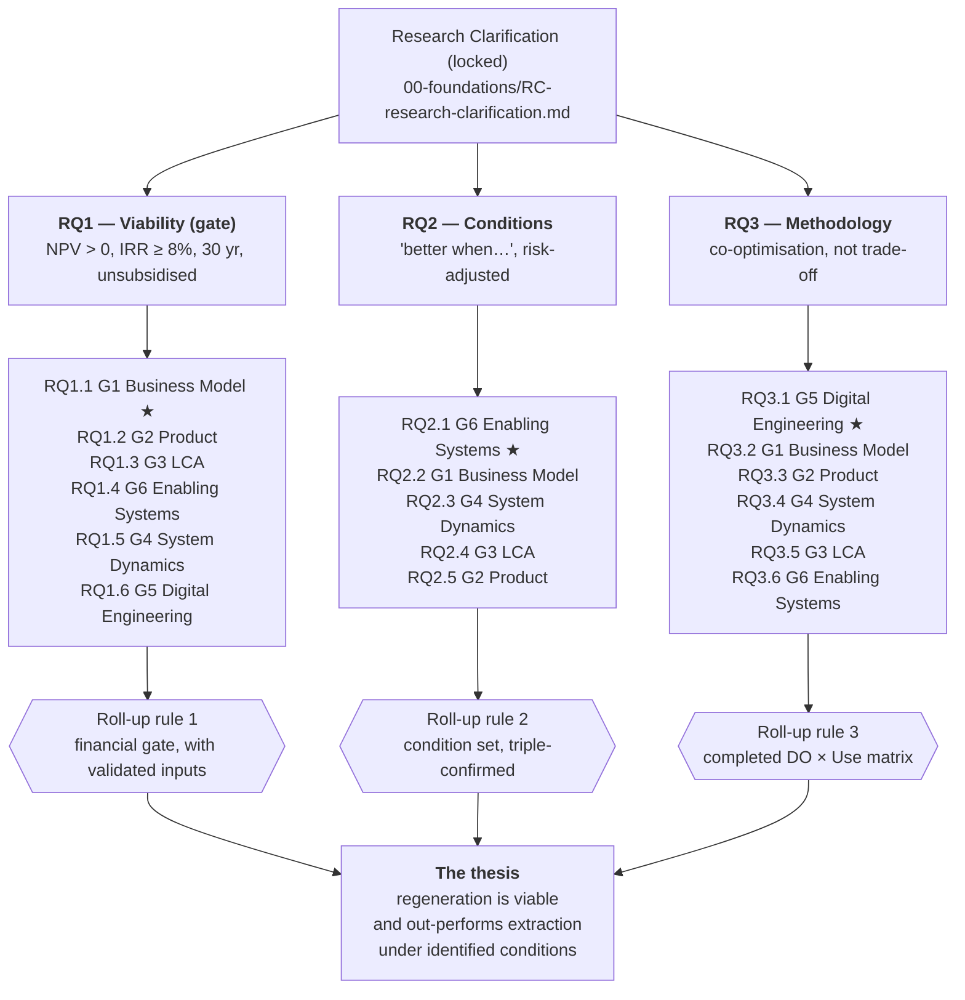

# Research-Question Decomposition

**Owner:** Regeneration Task-Force · **Version:** 1.0 (2026-08-11)
**Status:** The three top-level research questions (RQ1–RQ3) are **locked** in `00-foundations/RC-research-clarification.md`. The sub-questions below are the working decomposition and may be refined by the groups; the roll-up rules may not, because they define what counts as an answer.
**Abbreviations:** see [`GLOSSARY.md`](GLOSSARY.md).

---

## What this document is for

Each top-level research question (RQ) is too large for any one group to answer. This document splits each one into **sub-questions**, assigns each sub-question to exactly one group, and — the part that matters — states the **roll-up rule**: the explicit condition under which the sub-answers compose into an answer to the top-level RQ.

Without a roll-up rule, a decomposition is only a table of who does what. With one, answering the sub-questions *mechanically* answers the parent question, and it is always visible how far from an answer the Task-Force actually is.

**Three properties every sub-question here has:**

1. **One owner.** Exactly one group is accountable. Others may contribute, but only the owner delivers the answer.
2. **A named artefact.** The answer is a document, model, or dataset — not a discussion.
3. **An acceptance test.** A statement of what makes the answer good enough to roll up. If the test fails, the parent RQ is *unanswered*, which is different from *answered no*.

---

## The six groups

Group numbers are unique across the workspace and stable. Always refer to a group by number **and** name.

| Group | Name | Folder | Role |
|---|---|---|---|
| **Group 1** | Business Model | `04-business-model/` | Designs the PVaaS business model and the financial model |
| **Group 2** | Product Regeneration | `05-product-regeneration/` | Formalises regeneration in SysML v2: requirements, architecture, ecological flows |
| **Group 3** | LCA & Financial Integration | `06-lca-and-financial/` | Quantifies lifecycle impact and closes the loop back into the financial model; owns the MRV protocol |
| **Group 4** | System Dynamics | `06-system-dynamics/` | Models behaviour over time across economic, social and environmental perspectives |
| **Group 5** | Digital Engineering | `07-digital-engineering/` | Provides and validates the semantic bridge between all artefacts |
| **Group 6** | Enabling Systems | `08-enabling-systems/` | Maps the external conditions the model depends on and tests them against reality |

> **Note on folder numbering.** Groups 3 and 4 both sit under a folder prefixed `06-`, a leftover from the 2026-08-09 restructure. Group numbers are the authoritative identifiers; folder prefixes are not.

---

## The decomposition at a glance

★ = leading group for that RQ.

**Sequencing.** RQ1 is a hard gate: if the regenerative model cannot stand financially, RQ2 and RQ3 are moot. But the groups do not run in series — RQ3's evidence (the traceability matrix) accumulates as a by-product of answering RQ1 and RQ2, and RQ2's condition mapping feeds back into RQ1 as the bankability filter.

---

## RQ1 — Viability (the gate)

> **Can a regenerative PV business model reach positive NPV and IRR ≥ 8% over a 30-year lifecycle without dependency on external subsidy?**
> *Success criteria: C1 (NPV > 0 at 7% discount), C2 (IRR ≥ 8%).*

| Sub-RQ | Owner | Question | Answering artefact | Acceptance test |
|---|---|---|---|---|
| **RQ1.1** ★ | Group 1 — Business Model | What revenue and cost architecture does a regenerative PVaaS business have, and what NPV, IRR and payback does it produce over 30 years **with subsidies removed from the cash flows**? | Financial model recast for PVaaS: 30 yr, ≥ 3 scenarios, full capital structure | Every material assumption is documented and sourced; the unsubsidised case is run explicitly, not derived by adjustment |
| **RQ1.2** | Group 2 — Product Regeneration | What does the regenerative system physically consist of, and what does it cost to build, operate and decommission? | System architecture with a costed component list: CAPEX, OPEX, EOL cost inputs | Cost inputs trace to named components in the SysML model, not to a spreadsheet assumption |
| **RQ1.3** | Group 3 — LCA & Financial | What is the verified lifecycle GHG intensity of the regenerative system, and does it clear the threshold that makes the low-carbon premium claimable? | Verified gCO₂eq/kWh figure with its EPD and methodological basis | Figure is EPD-backed and IEA-PVPS Task 12-conformant, full Balance of System; the DO-5 threshold (< 15 gCO₂eq/kWh) is either met or explicitly missed |
| **RQ1.4** | Group 6 — Enabling Systems | Which revenue lines can actually be transacted in the target market **today**, and which depend on an enabling system that does not yet exist? | Bankability filter per revenue line: bankable now / needs enabling system / speculative | Every revenue line in RQ1.1 carries a classification with a named market precedent or a named missing enabler |
| **RQ1.5** | Group 4 — System Dynamics | Do the revenue and cost assumptions survive 30 years of feedback, or does the system structure erode them? | Dynamic-stability assessment of the financial model's assumptions | Each load-bearing assumption is either confirmed stable or flagged with the loop that undermines it |
| **RQ1.6** | Group 5 — Digital Engineering | Do the business model, CLD, financial model and SysML model describe the **same** system? | Semantic consistency report from the validation pipeline | Registry invariants I1–I7 pass; every concept used in the financial model resolves to a registry entry |

### Roll-up rule for RQ1

> **RQ1 is answered *yes* if and only if** the financial model from **RQ1.1** clears NPV > 0 **and** IRR ≥ 8% over 30 years with subsidies removed, **using**:
> - cost inputs accepted from **RQ1.2**,
> - the emissions figure accepted from **RQ1.3** wherever the low-carbon premium is priced,
> - **only** revenue lines classified bankable-now by **RQ1.4** (lines needing a future enabling system may appear in an upside scenario, never in the gate case),
> - under assumptions not falsified by **RQ1.5**,
>
> **and** **RQ1.6** confirms all four artefacts describe one system.
>
> **If any input is missing or fails its acceptance test, RQ1 is *unanswered*, not *answered no*.** This distinction is load-bearing: an unanswered gate means more work; a negative answer means the thesis is falsified. Never report one as the other.

### The honest failure modes

- Clearing the gate **only** with speculative revenue lines → the gate is not cleared. RQ1.4 exists to prevent this.
- Clearing the gate by **trading one capital against another** (profit funded by ecological or social harm) → fails the Triple Top Line test and the thesis fails on regeneration grounds even if it passes on financial grounds.
- Clearing the gate on a **static snapshot** that RQ1.5 shows is dynamically unstable → report as conditional, not as an answer.

---

## RQ2 — Conditions

> **Under which structural, regulatory, and market conditions does a regenerative PV model outperform a conventional PV baseline in risk-adjusted economic performance?**
> *Success criterion: C3 (risk-adjusted IRR vs. the SolarX baseline → identify conditions).*
> This is a "better when…" question, never an "always better" claim.

| Sub-RQ | Owner | Question | Answering artefact | Acceptance test |
|---|---|---|---|---|
| **RQ2.1** ★ | Group 6 — Enabling Systems | Which policy, market, supply-chain, grid, standards and governance conditions must hold, and which are hard blockers, soft enablers, or optional amplifiers? | Enabling-systems map, classification matrix, dependency map, critical path | Every condition is classified, its current state assessed against a named source, and its dependencies mapped |
| **RQ2.2** | Group 1 — Business Model | Which parameters move the risk-adjusted outcome against a clearly defined conventional baseline, and by how much? | Sensitivity analysis + risk-adjusted comparison vs. the SolarX baseline | The baseline is defined explicitly; each condition from RQ2.1 that is financially expressible has a quantified sensitivity |
| **RQ2.3** | Group 4 — System Dynamics | Which feedback structures create or destroy the advantage over 30 years, and where are the leverage points? | Loop catalogue (reinforcing / balancing, positive / negative impact) + leverage-point analysis | Each loop is traced to variables present in the business model; rebound effects are searched for explicitly, not assumed absent |
| **RQ2.4** | Group 3 — LCA & Financial | How does the environmental delta versus the baseline change under different supply-chain and end-of-life conditions? | Conditional LCA results per scenario | At least the module-sourcing and EOL-recovery conditions are quantified separately |
| **RQ2.5** | Group 2 — Product Regeneration | Which architectural choices are condition-dependent, and what does the system look like when a condition fails? | Design-option analysis: which requirements and architecture elements are contingent | Every contingent element names the condition it depends on, cross-referenced to RQ2.1 |

### Roll-up rule for RQ2

> **The answer to RQ2 is a set of statements** of the form:
> *"Regenerative PVaaS outperforms conventional PV on risk-adjusted return when {condition set}."*
>
> A condition enters that set **only if all three hold**:
> 1. **RQ2.1** names it, classifies it, and assesses its real-world state;
> 2. **RQ2.2** shows it is financially decisive — the outcome flips, or moves materially, when it changes;
> 3. **RQ2.3** shows the advantage it creates **persists** over the 30-year horizon rather than being eroded by feedback.
>
> **Conditions that fail any of the three are published in a second list — *claimed but unverified*.** RQ2 is not answered by the winning list alone. An honest "better when" answer includes what could not be verified, because a reader deciding whether to build this needs both.

---

## RQ3 — Methodology

> **How can regenerative outcomes (ecological, social, economic) be co-optimised in engineered systems using an integrated methodology linking business model, product architecture, and dynamic system modelling?**
> *Success criteria: C6 (10-step approach replicated in ≥ 2 contexts), C7 (SD model shows compounding reinforcing loops over 30 yr).*

| Sub-RQ | Owner | Question | Answering artefact | Acceptance test |
|---|---|---|---|---|
| **RQ3.1** ★ | Group 5 — Digital Engineering | Can artefacts spanning business model, system dynamics and MBSE be formally aligned from a single shared vocabulary and **machine-validated** for consistency? | Concept registry, OWL ontology, SHACL shapes, validation pipeline, regression suite | Validation runs automatically; injected defects are caught (regression fixtures pass); alignment is not asserted by hand |
| **RQ3.2** | Group 1 — Business Model | Can a business model be derived from DO-1…DO-8 and mapped into a CLD and a financial model **without loss of information**? | FBMC ↔ CLD ↔ financial-model trace, per desired outcome | Every DO reaches a canvas block and a financial line, or is explicitly recorded as non-bankable with a reason |
| **RQ3.3** | Group 2 — Product Regeneration | Can the same DOs be formalised as SysML v2 `requirement def` elements and traced through architecture to ports and flows? | DO → `requirement def` → `part def` → `port def` / flow traceability | The model validates in SysIDE; every DO has a requirement; every requirement has at least one satisfying architecture element |
| **RQ3.4** | Group 4 — System Dynamics | Can the same DOs be modelled dynamically across economic, social and environmental perspectives and integrated into one model that shows **compounding**? | Three perspective CLDs, one integrated CLD, behaviour-over-time sketches | Cross-perspective links are explicit; at least one reinforcing loop is shown to compound over 30 yr (**C7**) |
| **RQ3.5** | Group 3 — LCA & Financial | Can a desired outcome be quantified **independently** of the business model and fed back into it, closing the loop? | LCA → verified figure → financial model → recalculated IRR; plus a field-testable MRV protocol | The loop closes end-to-end at least once (DO-5 is the intended demonstrator); the MRV protocol survives a feasibility check (**C8**) |
| **RQ3.6** | Group 6 — Enabling Systems | Does the method surface the external conditions a design depends on, or does it only work in a vacuum? | An enabling-systems step integrated into the 10-step Regenerative Design Approach | The approach contains an explicit step that would have caught a missing enabling system in the PV pilot |

### Roll-up rule for RQ3

> **RQ3 is answered when every desired outcome DO-1…DO-8 traverses all four of its uses with a validated link at each hop** — that is, when the matrix below is complete and the links in it pass the RQ3.1 validation pipeline rather than being asserted in prose.
>
> This is deliberately mechanical. "The method integrates the disciplines" is an opinion; "all eight outcomes traverse all four uses and the links validate" is a checkable fact.
>
> **Caveat on C6 (≥ 2 contexts).** The PV pilot is context 1. This project does **not** deliver context 2 — validating the method beyond PV is explicitly out of scope for this cycle (see the README's scope table). RQ3's answer must therefore be stated as *"demonstrated in one context, replication designed for but not performed"*. Claiming C6 on one context would be overclaiming.

### The DO × Use matrix — the evidence for RQ3

Each desired outcome is defined **once** in `03-methodology/01-desired-outcomes-interface.md` and used **four ways**. This matrix is what RQ3's answer looks like when finished.

**Legend:** ● validated · ◐ drafted, not validated · ○ not started

| Desired outcome | ① Dynamics — CLD stock + loop (G4) | ② Product — SysML `requirement def` (G2) | ③ Feasibility — financial line (G1) | ④ Measurement — MRV method (G3) |
|---|---|---|---|---|
| **DO-1** Soil organic carbon | ◐ `SoilCarbon` | ◐ `SoilCarbonRequirement` | ◐ non-bankable; O&M cost line | ◐ soil sampling, EOV-aligned |
| **DO-2** On-site biodiversity | ◐ `SpeciesRichness` | ◐ `BiodiversityRequirement` | ◐ optionality; credits (Scenario C) | ◐ transect surveys, TNFD-aligned |
| **DO-3** Water retention | ◐ `SoilMoisture` | ◐ `WaterRetentionRequirement` | ◐ non-bankable; civil design cost | ◐ infiltration / runoff monitoring |
| **DO-4** Material circularity | ◐ `RecoverableMaterialBank` | ◐ `MaterialCircularityRequirement` | ◐ EOL recovery, 8–12 k€/MW | ◐ design-time spec + verified recovery |
| **DO-5** Lifecycle GHG intensity | ◐ driven by DO-8 | ◐ `LifecycleGHGRequirement` | ◐ **bankable** — premium 2–5 €/MWh | ◐ verified EPD, IEA-PVPS Task 12 |
| **DO-6** Community wealth retention | ◐ `LocalWealth` | ◐ `CommunityWealthRequirement` | ◐ **bankable** — WACC −50–100 bps | ◐ revenue-flow accounting |
| **DO-7** Energy access | ◐ couples to DO-6 | ◐ `EnergyAccessRequirement` | ◐ grant-dependent, 1–3% NPV | ◐ generation-share and tariff records |
| **DO-8** Supplier decarbonization | ◐ slow reinforcing loop | ◐ `SupplierCarbonRequirement` | ◐ procurement cost line | ◐ supplier EPD tracking, CBAM data |

**Current state: every cell is drafted, none validated.** The interface specifies all 32 cells; nothing has been built or machine-checked yet. Numeric targets are still TBD for seven of the eight outcomes — only DO-5 is anchored. That is the honest position, and it is why setting the DO targets ([#26](https://github.com/TheNightFox-1/SustainableTogether/issues/26)) gates almost everything else.

---

## Evidence ledger

One row per sub-question. This is the progress view for the whole Task-Force: how close each top-level RQ is to being answerable.

**Legend:** ● delivered · ◐ in progress · ○ not started

| Sub-RQ | Owner | Answering artefact | Feeds criteria | Status |
|---|---|---|---|---|
| RQ1.1 ★ | G1 Business Model | Financial model recast for PVaaS | C1, C2 | ◐ ownership-based model exists; PVaaS recast not started |
| RQ1.2 | G2 Product | Costed component list from the SysML model | C1 | ○ |
| RQ1.3 | G3 LCA | Verified gCO₂eq/kWh + EPD basis | C4 → C1 | ○ only a motor-system PoC exists |
| RQ1.4 | G6 Enabling Systems | Revenue-line bankability filter | C1 | ○ |
| RQ1.5 | G4 System Dynamics | Dynamic-stability assessment | C7 → C1 | ○ |
| RQ1.6 | G5 Digital Engineering | Semantic consistency report | C6 → C1 | ◐ pipeline built; not yet run against the PVaaS model |
| RQ2.1 ★ | G6 Enabling Systems | Classification matrix + critical path | C3 | ○ |
| RQ2.2 | G1 Business Model | Sensitivity + risk-adjusted comparison | C3 | ○ |
| RQ2.3 | G4 System Dynamics | Loop catalogue + leverage points | C3, C7 | ○ CLD v2/v3 exist as input |
| RQ2.4 | G3 LCA | Conditional LCA per scenario | C4 | ○ |
| RQ2.5 | G2 Product | Design-option analysis | C3 | ○ |
| RQ3.1 ★ | G5 Digital Engineering | Registry, ontology, SHACL, regression suite | C6 | ● built for FBMC↔CLD; extension to SysML pending |
| RQ3.2 | G1 Business Model | FBMC ↔ CLD ↔ finance trace | C6 | ◐ method exists; trace not populated |
| RQ3.3 | G2 Product | DO → requirement → architecture trace | C6 | ○ |
| RQ3.4 | G4 System Dynamics | Three perspective CLDs + integrated CLD | C7 | ○ |
| RQ3.5 | G3 LCA | Closed LCA↔BM loop + MRV protocol | C8 | ◐ MRV protocol drafted; loop not closed |
| RQ3.6 | G6 Enabling Systems | Enabling-systems step in the 10-step approach | C6 | ○ |

**Reading the ledger:** RQ1 currently has **one** of six inputs partially in place. No top-level RQ is close to answerable. The single highest-leverage unblock is setting the numeric DO targets, which gates RQ1.1 pricing, RQ3.4 parameterisation, and RQ3.5 MRV thresholds simultaneously.

---

## Traceability to success criteria

| Criterion | Measure | Answered by |
|---|---|---|
| **C1** Financial viability | NPV > 0 at 7% discount over 30 yr | RQ1.1, with inputs from RQ1.2, RQ1.3, RQ1.4 |
| **C2** Acceptable return | IRR ≥ 8% | RQ1.1 |
| **C3** Risk-adjusted comparison | Risk-adjusted IRR vs. SolarX baseline | RQ2.2, conditions from RQ2.1, persistence from RQ2.3 |
| **C4** Ecological improvement | Lifecycle GHG reduction; biodiversity gain | RQ1.3, RQ2.4 (DO-1, 2, 3, 5) |
| **C5** Social value | Community wealth retention; energy access | RQ3.2 feasibility columns (DO-6, 7); measured via RQ3.5 |
| **C6** Methodological validity | 10-step approach replicated | RQ3.1–RQ3.3, RQ3.6 — **one context only this cycle** |
| **C7** Dynamic proof | Compounding reinforcing loops over 30 yr | RQ3.4, supported by RQ1.5 and RQ2.3 |
| **C8** MRV feasibility | Protocol is field-testable | RQ3.5 |

> **C5 has no owning sub-RQ of its own.** Community wealth and energy access are currently carried inside RQ3.2 and RQ3.5 rather than being tested directly. If the Task-Force wants social value evidenced as strongly as financial value, C5 needs its own sub-question with an owner. Flagged for the first meeting.

---

## Change control

- **Top-level RQ1–RQ3 are locked** in the Research Clarification. Changing them reopens the DRM Research Clarification stage and requires a Task-Force decision.
- **Sub-questions** may be refined, split, or reassigned by the owning group, provided the parent's roll-up rule still holds. Record the change here and in the group's task brief in the same commit.
- **Roll-up rules may not be weakened** to make an answer reachable. If a rule cannot be satisfied, the honest output is "unanswered", and that is a legitimate research result.
- Every group task brief states the sub-RQs it owns and links back to this file. When you edit one, edit the other.

---

## Related

- [`00-foundations/RC-research-clarification.md`](00-foundations/RC-research-clarification.md) — the locked RQs and success criteria
- [`03-methodology/01-desired-outcomes-interface.md`](03-methodology/01-desired-outcomes-interface.md) — DO-1…DO-8, the spine the RQ3 matrix is built on
- [`03-methodology/00-regenerative-design-approach.md`](03-methodology/00-regenerative-design-approach.md) — the 10-step method that is RQ3's object of study
- [`GLOSSARY.md`](GLOSSARY.md) — all abbreviations
- [`GAPS-AND-RISKS.md`](GAPS-AND-RISKS.md) — the devil's-advocate view
- [`README.md`](README.md) — the workspace map
