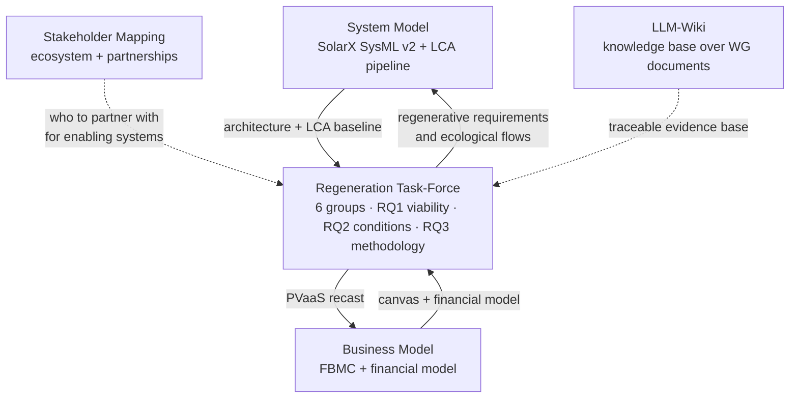

# Projects

`SustainableTogether Projects/` is where the work actually happens. The [WG task groups](https://github.com/TheNightFox-1/SustainableTogether/blob/main/WORKSTREAMS.md) describe *who* researches what; this page describes *what is being built*.

Five projects are active. They are not independent — the Regeneration Task-Force consumes the System Model, the Business Model work, and the LCA pipeline, and feeds results back into all three.

| Project | What it produces | State |
|---|---|---|
| [Regeneration Task-Force](#regeneration-task-force) | Proof that a regenerative PV business is more viable than the extractive one it replaces | Framing complete, group work starting |
| [System Model](#system-model) | The SysML v2 / MBSE model of SolarX and, later, SustainaSun | SolarX physical architecture complete |
| [Business Model](#business-model) | The SustainaSun business and financial model | Financial model built, being recast for a service model |
| [Stakeholder Mapping](#stakeholder-mapping) | Who the WG should partner with, and how the ecosystem connects | Phase 2 — 12-node pilot done, expanding to 30+ |
| [LLM-Wiki demonstrator](#llm-wiki-demonstrator) | A working knowledge wiki built over the WG's own documents | Demonstrator complete |

---

## Regeneration Task-Force

**Location:** `SustainableTogether Projects/Regeneration/` · [Project board](https://github.com/users/TheNightFox-1/projects/5) · Issues [#26–#39](https://github.com/TheNightFox-1/SustainableTogether/issues?q=is%3Aissue+label%3Aregeneration)

The largest project in the repository, and the one that tests the whole SolarX → SustainaSun thesis with numbers.

**The question it exists to answer:** can a solar-PV company be redesigned so that normal commercial operation actively *heals* ecological, social and economic systems — and still beat the extractive version financially?

**Theoretical anchor:** Fischer et al. (2024), "Mainstreaming regenerative dynamics for sustainability", *Nature Sustainability* 7, 964–972. Regeneration as an "upward helix": an outcome that improves repeatedly, is partly self-perpetuating, but needs ongoing input to keep rising.

### Three research questions

| RQ | Question | Lead group |
|---|---|---|
| **RQ1 — Viability (gate)** | Can a regenerative PV business model reach positive Net Present Value and an Internal Rate of Return ≥ 8% over 30 years without subsidy dependency? | Group 1 — Business Model |
| **RQ2 — Conditions** | Under which structural, regulatory and market conditions does regenerative outperform conventional, risk-adjusted? "Better when…", not "always better". | Group 6 — Enabling Systems |
| **RQ3 — Methodology** | How can ecological, social and economic outcomes be co-optimised through an integrated method linking business model, product architecture and dynamic modelling? | Group 5 — Digital Engineering |

**RQ1 is a hard gate.** If regeneration cannot stand on its own financially, RQ2 and RQ3 are moot.

### Six working groups

Each RQ is answered by the combined output of several groups. No group answers one alone.

| Group | Name | Mandate |
|---|---|---|
| Group 1 | Business Model | Design the Photovoltaics-as-a-Service business model and prove it is viable without subsidy |
| Group 2 | Product Regeneration | Formalise regeneration in SysML v2 — requirements, architecture, ecological flows |
| Group 3 | LCA & Financial Integration | Quantify lifecycle impact, close the loop back into the financial model, own the measurement protocol |
| Group 4 | System Dynamics | Model behaviour over time across economic, social and environmental perspectives |
| Group 5 | Digital Engineering | Provide and validate the semantic bridge keeping every artefact describing the same system |
| Group 6 | Enabling Systems | Map the external conditions the model depends on and test them against reality |

### How the answers compose

Each research question is split into sub-questions, each with **one owner, one named artefact, and one acceptance test**. Each question then has a **roll-up rule** — the explicit condition under which the sub-answers compose into an answer to the parent.

Two rules are worth knowing even if you never open the detail:

- **A missing input means *unanswered*, not *no*.** An unanswered gate means more work is needed; a negative answer means the thesis is falsified. The project never reports one as the other.
- **Roll-up rules are not weakened to make an answer reachable.** "We could not verify this" is published alongside what was verified.

The full tree, roll-up rules and progress ledger are in the Task-Force's [`RQ-DECOMPOSITION.md`](https://github.com/TheNightFox-1/SustainableTogether/blob/main/SustainableTogether%20Projects/Regeneration/RQ-DECOMPOSITION.md).

### The spine: eight desired outcomes

Everything the six groups build traces back to one list. Each desired outcome is defined **once** and used **four ways** — as a stock in the System Dynamics model, a SysML v2 `requirement def`, a line in the financial model, and a measurement target in the monitoring protocol.

| | Outcome | Capital |
|---|---|---|
| DO-1 | Soil organic carbon | Natural |
| DO-2 | On-site biodiversity | Natural |
| DO-3 | Water retention | Natural |
| DO-4 | Material circularity | Manufactured |
| DO-5 | Lifecycle greenhouse-gas intensity | Natural |
| DO-6 | Community wealth retention | Social / Financial |
| DO-7 | Energy access | Social |
| DO-8 | Supplier decarbonization | Natural / Manufactured |

No outcome may be traded off against another — Economy, Ecology and Equity all positive, or the design is not regenerative. Setting the numeric targets for these outcomes is the first Task-Force decision, and it gates most of the downstream work.

### Where to start reading

1. [`README.md`](https://github.com/TheNightFox-1/SustainableTogether/blob/main/SustainableTogether%20Projects/Regeneration/README.md) — the map
2. `GLOSSARY.md` — every abbreviation in the workspace
3. `00-foundations/RC-research-clarification.md` — the locked research questions and success criteria
4. `RQ-DECOMPOSITION.md` — how the questions break down and what counts as an answer
5. `03-methodology/01-desired-outcomes-interface.md` — the spine
6. `GAPS-AND-RISKS.md` — the honest view of what is still missing

---

## System Model

**Location:** `SustainableTogether Projects/System Model/`

The MBSE backbone of the whole project. See the [System Model](system-model.md) page for the modelling detail.

- **`SolarX/`** — the as-is baseline. A SysML v2 model of a conventional PV system following the SYSMOD 9-step method: PV array, inverter, battery storage, energy management controller, grid connection, monitoring unit, plus commissioning and maintenance boundaries. The physical layer is complete. It also holds the openLCA integration proof-of-concept, a four-layer SysML → RDF → ontology → SPARQL pipeline.
- **`MBSE for C2C/`** — reference material on Cradle-to-Cradle circular flows.

The regenerative layer — ecological requirements, biological and water flows, end-of-life material recovery — is Group 2's work in the Regeneration Task-Force. The model is **extended, never overwritten**.

---

## Business Model

**Location:** `SustainableTogether Projects/Business Model/SustainaSun EMEASEC2026/`

The business-side counterpart to the system model: a Flourishing Business Model Canvas analysis, a flourishing-business assessment, and a financial model.

This work now continues inside the Regeneration Task-Force as Group 1, where the direction is locked to **Photovoltaics-as-a-Service** — SustainaSun sells the outcome (clean energy plus ecological and social value) as an ongoing service and retains ownership of the assets. The existing ownership-based financial model becomes a reference input to be recast, not a competing design.

---

## Stakeholder Mapping

**Location:** `SustainableTogether Projects/Sustainability Stakeholder Mapping/`

Systematic identification, categorisation and network analysis of the organisations relevant to sustainable systems engineering, modelled in SysML and analysed with network-science metrics.

Three goals: find organisations whose expertise strengthens the WG, map partnership opportunities for publications, events and tools, and understand the target audience of SE practitioners, industries and educators.

Currently in Phase 2 — a 12-node pilot is complete and the map is expanding towards 30–40 stakeholders.

---

## LLM-Wiki demonstrator

**Location:** `SustainableTogether Projects/LLM-Wiki/`

A working knowledge wiki built over 14 of the WG's own PDFs, accompanying the `LLM-Wiki-Sustainability-WG.pptx` session deck. Open `demonstrator/llm-wiki-demonstrator.html` in any browser — no server, no install.

What makes it more than a demo: every claim on every page carries a citation back to a specific source PDF with a page or slide number, and the contradictions it surfaces were **found in the corpus, not invented for the demo** — including one between two of the WG's own webinar episodes.

Start with `demonstrator/GETTING-STARTED.md` if the pattern is new to you; it assumes no prior knowledge of git, Obsidian, Python or AI tooling.

---

## How the projects connect

---

## Contributing to a project

Pick an unassigned issue on the relevant [project board](https://github.com/TheNightFox-1/SustainableTogether/issues), comment to claim it, work on a branch, and open a pull request. The [Contributing guide](contributing.md) has the full workflow, and [GitHub Onboarding](github-onboarding.md) covers the basics if you have never used GitHub before.
